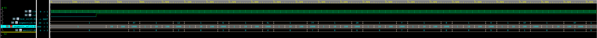
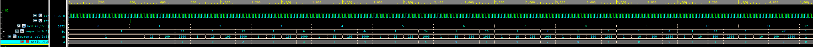

# Lab 1 notes

## 3. SpyGlass lint

### Block `initial_rtl`

#### First violations

The following 3 violations were reported by all lints (Goals `lint/lint_rtl`, `lint/lint_rtl_enhanced`, `lint/lint_turbo_rtl`, `lint/lint_functional_rtl`)

1. **STX_VE_274 (1) : The Param assignment list must be complete.**

   Description: _Param assignment list is incomplete_\
   Location: `RTL/s7_display.v:22`\
   Reason: trailing comma in parameter list\
   Solution: remove trailing comma (in line 21)\
   Comment: The list is not incomplete. This is just a syntax error.
2. **STX_VE_479 (2) : A Verilog-2005/SystemVerilog/SystemVerilog-2009 construct cannot be used without specifying corresponding 'set_option'.**

   1. Description: _Syntax error near ( ; ). Please use 'set_option enableSV yes' to support SystemVerilog construct ( Null statement )_\
      Location: `RTL/bcd_mux.v:24`\
      Reason: duplicate semicolon creates a null statement\
      Solution: remove one of the semicolons (in line 24)
   2. Description: _Syntax error near ( function ). Please use 'set_option enableSV yes' to support SystemVerilog construct ( Function declaration outside module scope )_'\
      Location: `RTL/bcd_mux.v:50`\
      Reason: function `clogb2` is declared outside module\
      Solution: move the function to `bcd_mux` module scope, by moving `endmodule` from line 48 to the end of file

#### Second iteration

After fixing the violations listed above, all goals reported the following 2 violations:

1. **STX_VE_606 (2) : Only those identifiers can be used that are declared in the current scope.**

   Description: _Identifier ( bcd ) not declared in current scope_\
   Locations: `RTL/decoder.v:9`, `RTL/decoder.v:11`\
   Reason: typo in signal name\
   Solution: replace both instances of `bcd` with `i_bcd`

#### Third iteration

After fixing the violation listed above, all goals reported the following 4 violations:

1. **STX_VE_361 (4) : A procedural assignment statement cannot drive a net other than reg type.**

   Description: _Procedural assignment statement cannot drive a net : r_display_count_\
   Locations: `RTL/bcd_mux.v:33`, `RTL/bcd_mux.v:36`, `RTL/bcd_mux.v:37`, `RTL/bcd_mux.v:38`\
   Reason: `r_display_count` is declared as `wire` but used like `reg`\
   Solution: change `wire` to `reg` in `r_display_count` declaration (in line 29)

#### Fourth iteration

After fixing the violation listed above, the following violations were reported:

1. **STARC05-2.11.3.1 (1) : Sequential and combinational parts of an FSM description should be separated**

   Description: _Combinational and sequential parts of an FSM 'bcd_mux.r_display_count' described in same always block_\
   Goals: `lint/lint_rtl`, `lint/lint_turbo_rtl`\
   Location: `RTL/bcd_mux.v:37`\
   Reason: SpyGlass considers this an FSM and is unhappy about describing combinational logic in assignment\
   Solution: calculate the next value of of `r_display_count` as a separate signal
2. **W71 (1) : A case statement(or selected signal assignment) does not have a default or OTHERS clause**

   Description: _Case statement does not have a default clause and is not preceded by assignment of target signal in combinational block[Hierarchy: ':s7_display:decoder_i@decoder']_\
   Goals: `lint/lint_rtl`, `lint/lint_rtl_enhanced`, `lint/lint_turbo_rtl`\
   Location: `RTL/decoder.v:11`\
   Reason: `segments` may not have assigned value and becomes an inferred latch\
   Solution: add `default` case that assigns `7'b1111111` (all off) to `segments` or make this assigment in the same `always`, before `case`\
   Comment: the `case` is also missing a case for `i_bcd == 5`
3. **W110 (1) : An instance port connection has incompatible width compared to the port definition**

   Description: _Incompatible width for port 'o_segments'(width 7 in module 'decoder') on instance 'decoder_i'(actual width 1) [Hierarchy: ':s7_display']_\
   Goals: `lint/lint_rtl`, `lint/lint_rtl_enhanced`, `lint/lint_turbo_rtl`\
   Location: `RTL/s7_display.v:36`\
   Reason: `segments` is not declared and because the design does not use `` `default_nettype none``, a wire (of width 1) is created by default\
   Solution: declare `segments` net (type `wire`) of width 7 (`[6:0]`, same as `o_segments`)
4. **W486 (1) : Shift overflow - some bits may be lost**

   Description: _Rhs width '4' with shift (Expr: '({{ (DISPLAYS_NUM - 1){ 1'b0} }  ,1'b1} << r_display_count)') is more than lhs width '1' (Expr: 'bcd_sel'), this may cause overflow [Hierarchy: ':s7_display:bcd_mux_i@bcd_mux']_\
   Goals: `lint/lint_rtl`, `lint/lint_rtl_enhanced`, `lint/lint_turbo_rtl`\
   Location: `RTL/bcd_mux.v:46`\
   Reason: `bcd_sel` is not declared (a typo, should be `o_bcd_sel`) and because the design does not use `` `default_nettype none``, a wire (of width 1) is created by default\
   Solution: change `bcd_sel` (in line 46) to `o_bcd_sel`
5. **InferLatch (1) : Latch inferred**

   Description: _Latch inferred for signal 'segments[6:0]' in module 'decoder'_\
   Goals: `lint/lint_rtl`, `lint/lint_rtl_enhanced`, `lint/lint_turbo_rtl`\
   Location: `RTL/decoder.v:20`\
   Reason: see point 2. in this list (missing default)\
   Solution: see point 2. in this list (missing default)
6. **W336 (3) : Blocking assignment should not be used in a sequential block (may lead to shoot through)**

   1. Description: _Blocking assignment 'r_sel_counter = (r_sel_counter + 1);' used inside a 'FlipFlop' inferred sequential block_\
   Goals: `lint/lint_rtl`, `lint/lint_rtl_enhanced`, `lint/lint_turbo_rtl`\
   Location: `RTL/bcd_mux.v:24`\
   Reason: a blocking assignment (`=`) is used when assigning to a flip-flop instead of a non-blocking one (`<=`)\
   Solution: change the assignment to non-blocking (`<=`)
   2. Description: _Blocking assignment 'r_sel_counter = 0;' used inside a 'FlipFlop' inferred sequential block_\
   Goals: `lint/lint_rtl`, `lint/lint_rtl_enhanced`\
   Locations: `RTL/bcd_mux.v:20`, `RTL/bcd_mux.v:23`\
   Reason: blocking assignments (`=`) are used when assigning to a flip-flop instead of non-blocking ones (`<=`)\
   Solution: change the assignments to non-blocking (`<=`)
7. **W528 (1) : A signal or variable is set but never read**

   Description: _Variable 'bcd_sel' set but not read.[Hierarchy: ':s7_display:bcd_mux_i@bcd_mux']_\
   Goals: `lint/lint_rtl`, `lint/lint_turbo_rtl`\
   Location: `RTL/bcd_mux.v:46`\
   Reason: `bcd_sel` is not declared (a typo, should be `o_bcd_sel`) and because the design does not use `` `default_nettype none``, a wire (of width 1) is created by default, but other places expect the correct name\
   Solution: change `bcd_sel` (in line 46) to `o_bcd_sel`
8. **AutomaticFuncTask-ML (1) : Use automatic functions/tasks in modules and interfaces.**

   Description: _Function 'clogb2' should be declared as automatic [Hierarchy: ':s7_display:bcd_mux_i@bcd_mux']_\
   Goals: `lint/lint_rtl_enhanced`\
   Location: `RTL/bcd_mux.v:48`\
   Reason: function `clogb2` is not declared as automatic and is static by default\
   Solution: make the function automatic (`function automatic integer clogb2;`)
9. **STARC-2.3.4.3 (2) : A flip-flop should have an asynchronous set or an asynchronous reset**

   1. Description: _Flip-flop 'r_display_count[1:0]' has neither asynchronous set nor asynchronous reset. [Hierarchy: 's7_display.bcd_mux_i']_\
      Goals: `lint/lint_rtl_enhanced`\
      Location: `RTL/bcd_mux.v:38`\
      Reason: the flip-flop has synchronous reset\
      Solution: add `negedge i_rst` to the sensitivity list to make reset asynchronous
   2. Description: _Flip-flop 'r_sel_counter[3:0]' has neither asynchronous set nor asynchronous reset. [Hierarchy: 's7_display.bcd_mux_i']_\
      Goals: `lint/lint_rtl_enhanced`\
      Location: `RTL/bcd_mux.v:24`\
      Reason: the flip-flop has synchronous reset\
      Solution: add `negedge i_rst` to the sensitivity list to make reset asynchronous
10. **UndrivenOutPort-ML (1) : Undriven but loaded output port of a module detected**

    Description: _Detected undriven output port o_bcd_sel[3:0]_\
    Goals: `lint/lint_rtl_enhanced`\
    Location: `RTL/bcd_mux.v:12`\
    Reason: `o_bcd_sel` is undriven, because of a typo in assignment in line 46\
    Solution: change `bcd_sel` in line 46 to `o_bcd_sel`
11. **W164b (2) : LHS width is greater than RHS width of assignment (Extension)**

    1. Description: _LHS: 'o_segments' width 7 is greater than RHS: 'segments' width 1 in assignment [Hierarchy: ':s7_display']_\
       Goals: `lint/lint_rtl_enhanced`\
       Location: `RTL/s7_display.v:39`\
       Reason: `segments` is not declared and because the design does not use `` `default_nettype none``, a wire (of width 1) is created by default\
       Solution: declare `segments` net (type `wire`) of width 7 (`[6:0]`, same as `o_segments`)
    2. Description: _LHS: 'bcd_out' width 4 is greater than RHS: 'i_bcd_data[(4 * ((DISPLAYS_NUM - r_display_count) - 1)) +:3] ' width 3 in assignment [Hierarchy: ':s7_display:bcd_mux_i@bcd_mux']_\
       Goals: `lint/lint_rtl_enhanced`\
       Location: `RTL/bcd_mux.v:42`\
       Reason: part select is `+:3`, but 4 bytes should be selected\
       Solution: change part select to `+: 4`
12. **W241 (2) : Output is never set**

    Description: _Output 'o_bcd_sel[3:0]' is never set.[Hierarchy: ':s7_display:bcd_mux_i@bcd_mux']_\
    Goals: `lint/lint_rtl_enhanced`\
    Location: `RTL/bcd_mux.v:12`\
    Reason: `o_bcd_sel` is undriven, because of a typo in assignment in line 46\
    Solution: change `bcd_sel` in line 46 to `o_bcd_sel`
13. **Av_init01 (1) : Reports initial setup issues of the design.**

    Description: _Could not find clocks for all the flops. Please add clock SGDC constraint to the design_\
    Goals: `lint/lint_functional_rtl`\
    Location: `RTL/s7_display.v:1`\
    Reason: constraints file was not included in project\
    Solution: add `RTL/s7.sgdc` to project (`read_file -type sgdc RTL/s7.sgdc`)

#### Fifth iteration

No violations reported.

### Block `rtl_handoff`

No violations reported.

## 4. Simulation

When "5" should be displayed, `segments` do not form a valid digit (is all ones).

This is because in `decoder.v` the case has no case for `5`.

## 5. Additional "guideline" rules

1. **ClkName (2) : Clock name does not follow the naming convention.**

   Description: _Clock signal name 'i_clk' should be clk or start with clk\__\
   Locations: `RTL/s7_display.v:26`, `RTL/bcd_mux.v:19`\
   Solution: rename clock signal to `clk` (remember about .sgdc)
2. **ParamName (4) : Parameter/generic name does not follow the naming convention**

   1. Description: _Parameter name DISPLAYS_NUM does not follow naming convention_\
      Locations: `RTL/s7_display.v:3`, `RTL/bcd_mux.v:3`\
      Reason: parameter name must not be longer than 8 characters\
      Solution: rename parameter to `DISP_NUM`
   2. Description: _Parameter name MULTIPLEX_CLK_COUNT does not follow naming convention_\
      Locations: `RTL/s7_display.v:4`, `RTL/bcd_mux.v:4`\
      Reason: parameter name must not be longer than 8 characters\
      Solution: rename parameter to `CC_PER_D`
3. **RegOutName (2) : Register output signal does not follow naming convention.**

   1. Description: _Register output name 'r_sel_counter' should end with \_r_\
      Location: `RTL/bcd_mux.v:24`\
      Solution: rename to `sel_counter_r`
   2. Description: _Register output name 'r_display_count' should end with \_r_
      Location: `RTL/bcd_mux.v:37`
      Solution: rename to `display_count_r`
4. **ResetName (1) : Reset name does not follow the naming convention.**

   Description: _Reset signal name 'i_rst' should start with rst_\
   Location: `RTL/bcd_mux.v:36`\
   Solution: rename to `rst` (remember about .sgdc)
5. **SepTFMacro-ML (1) : Task/functions/macros should be defined in separate file**

   Description: _Define task/functions/macros in a separate file_\
   Location: `RTL/bcd_mux.v:46`\
   Solution: Move the function to a separate file (`clogb2.v`) and `` `include`` it

The _ParamName_ rule (amongst other things) restricts the name length to 8 characters, because longer _reduce readability_. Changing parameter names to adhere to this rule, changes readability much more...

## 6. Stopwatch

The stopwatch implementation required changing the number of displays to 6, which revealed another problem in `bcd_mux.v`. `r_display_count` has a range [0, `DISPLAYS_NUM`] (inclusive), but the upper bound should be exclusive (max `DISPLAYS_NUM-1`). This could not be observed with `DISPLAYS_NUM` equal to a power of 2, such as 4 previously, because of `r_display_count` width.

Goals `lint/lint_rtl` and `lint/lint_turbo_rtl` report violation in `RTL/stopwatch.v:51`:

> FlopEConst (1) : Flip-flop enable pin is permanently disabled or enabled
>
> Enable pin EN on Flop s7_stopwatch.stopwatch_i.ms_1_r[0] (master RTL_FDCE) is  always enabled (tied high)(connected to s7_stopwatch.stopwatch_i.sub_ms_wrap)

This violation occurs, because when `CYCLES_PER_MS` is `1`, signal `sub_ms_wrap` is assigned constant `1`, by design. This is expected and for greater values of `CYCLES_PER_MS` there is no violation, as contitional generate follows a different path, that does not assign a constant.
