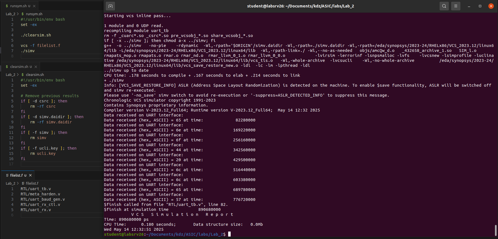
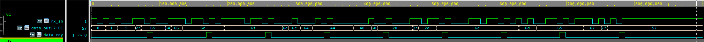
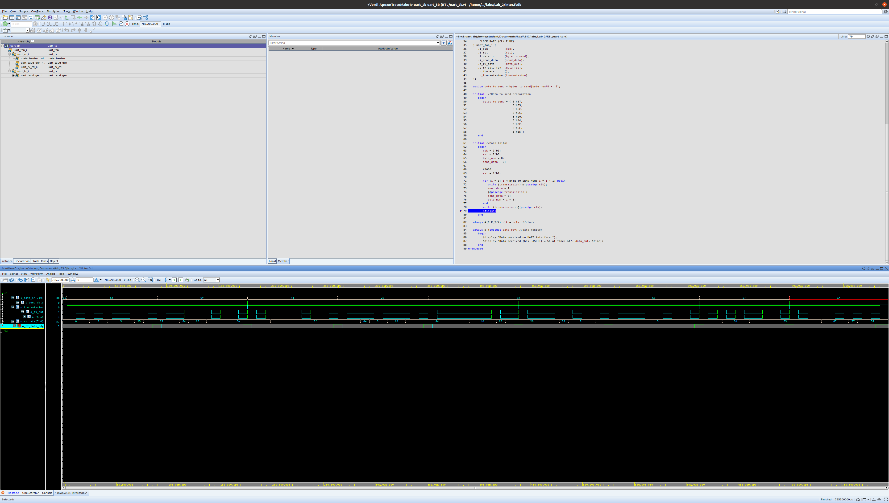
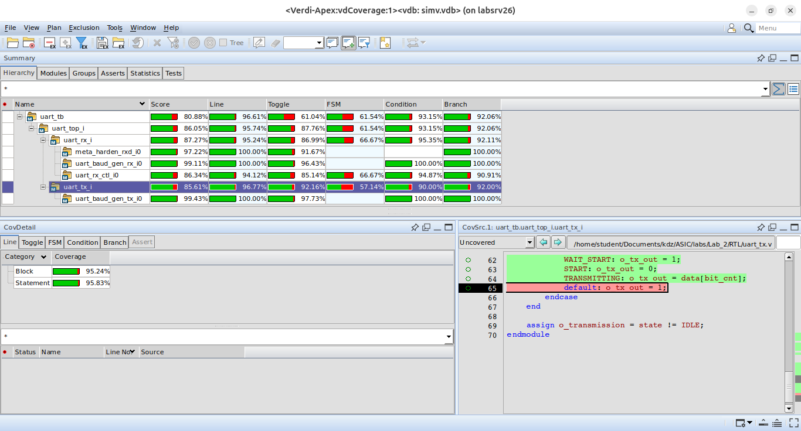
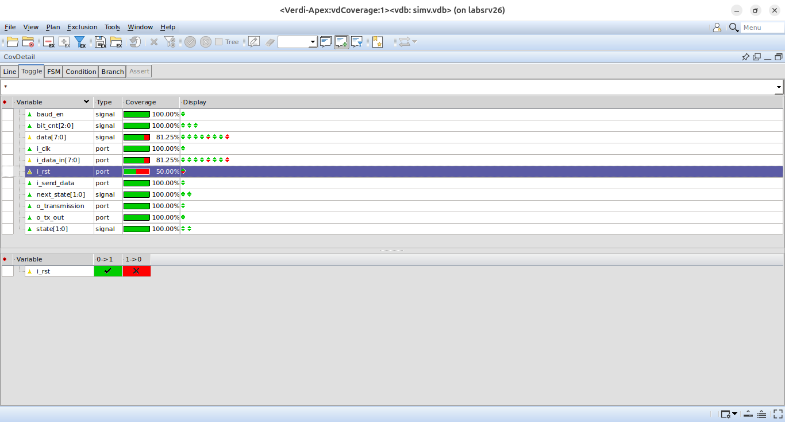
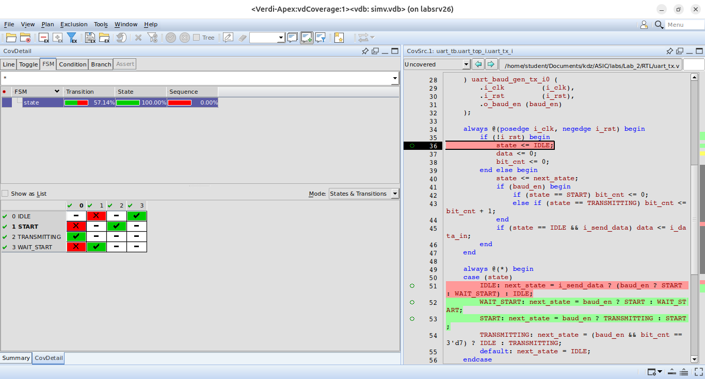

---
# pandoc report.md --lua-filter ../pandoc-include-code-files/include-code-files.lua report.pdf

# Metadata
title: Advanced ASIC Design
subtitle: "Exercise no 2: VCS and Verdi"
author: Krzysztof Dziembała
date: "2025-05-20"

# Pandoc document settings
lang: en-GB
# Pandoc LaTeX variables
geometry: [a4paper, bindingoffset=0mm, inner=30mm, outer=30mm, top=30mm, bottom=30mm]
documentclass: report
fontsize: 12pt
colorlinks: true
numbersections: true
toc: true
lof: true # List of figures

header-includes:
  # # TikZ-timing package for timing diagrams
  # - |
  #   ````{=latex}
  #   \usepackage{tikz-timing}
  #   ````
  # # TikZ-timing: set background for D (data) to the same as on the lecture slides #FFFFCC
  # - |
  #   ````{=latex}
  #   \tikzset{timing/d/background/.style={fill={rgb,255:red,255; green,255; blue,204}}}
  #   ````
  # Remove "Chapter N" from the line above chapter name in report class document
  # I could not include a file for some reason, but this works
  - |
    ````{=latex}
    \usepackage{titlesec}
    \titleformat{\chapter}
      {\normalfont\LARGE\bfseries}{\thechapter.}{1em}{}
    \titlespacing*{\chapter}{0pt}{3.5ex plus 1ex minus .2ex}{2.3ex plus .2ex}
    ````
  # Keep footnote numbering
  - |
    ````{=latex}
    \counterwithout{footnote}{chapter}
    ````
  # Packages required for Logisim tables
  # - |
  #   ````{=latex}
  #   \usepackage{colortbl}
  #   \usepackage[dvipsnames]{xcolor}
  #   \usepackage{tikz-timing}
  #   \usepackage{tikz}
  #   \usetikzlibrary{karnaugh}
  #   ````
  # Wrap long source code lines and set smaller code font size
  - |
	  ````{=latex}
	  \usepackage{fvextra}
	  \DefineVerbatimEnvironment{Highlighting}{Verbatim}{breaklines,breakanywhere,  fontsize=\footnotesize,commandchars=\\\{\}}
	  ````
  # Allow hyphenation in `monospaced` text
#   - |
#     ````{=latex}
#     \usepackage[htt]{hyphenat}
#     ````
  # Don't start chapter on new page (remove clearpage)
  # - |
  #   ````{=latex}
  #   \usepackage{etoolbox}
  #   \makeatletter
  #   \patchcmd{\chapter}{\if@openright\cleardoublepage\else\clearpage\fi}{}{}{}
  #   \makeatother
  #   ````
---

<!-- Tasks start from number 3, so manually change chapter numbering -->
\setcounter{chapter}{1}

<!-- markdownlint-disable MD025 -->
# Project analysis - `meta_harden`

The `meta_harden` module contains a 2 stage synchronizer (in $\Rightarrow$ DFF $\Rightarrow$ DFF $\Rightarrow$ out) to prevent possible metastability caused by `i_rx_in` being an external input that is most likely not synchronised with the module's clock (`i_clk`).

# Simulation in text mode

Ignoring the part responsible for removing previous results to always force full rebuild, the script executed two simple commands:

```bash
vcs -f filelist.f
./simv
```

The file list used by the command had the following content:

```{.text .numberLines include="filelist.f" endLine=5}
```



Simulation output is presented on Fig. \ref{fig-sim-text}.

In the next step of this exercise, `$display` statements, shown below, have been added to the code responsible for setting `rx_in` and produced output visible on Fig. \ref{fig-sim-monitor}.

```diff
diff --git a/Lab_2/RTL/uart_tb.v b/Lab_2/RTL/uart_tb.v
index 034f2ae..00e276d 100644
--- a/Lab_2/RTL/uart_tb.v
+++ b/Lab_2/RTL/uart_tb.v
@@ -89,6 +89,11 @@ module uart_tb
            bit_num = bit_num + 1;
            rx_in = bits_to_send[bit_num];
            if (bit_num >= BIT_TO_SEND_NUM) rx_in = 1'b1;
+           if (bit_num < BIT_TO_SEND_NUM) begin
+            if ((bit_num-1) % 10 == 0) $display("Start Bit, at time: %t", $time);
+            else if ((bit_num-1) % 10 == 9) $display("Stop Bit, at time %t", $time);
+            else $display("Data send = %0d, at time: %t", rx_in, $time);
+           end
         end

    always @ (posedge data_rdy) //data monitor
```


According to the simulation, the receiver works correctly and receives all the data without any errors. Figures \ref{fig-sim-text} and \ref{fig-sim-monitor} show the receiver returning a sequence `0x65`, `0x6e`, `0x6f`, `0x44`, `0x20`, `0x6c`, `0x6c`, `0x65`, `0x57` (ASCII string _"Well Done"_ in reverse), with Fig. \ref{fig-sim-monitor} displaying the bits being sent (e.g. `<start>11101010<end>` for `0x57`, because UART is LSB first). Data ready is reported before stop bit is received and verified, but this is documented, therefore I assume this was the intention.

# Simulation in graphical mode

To run the simulation with GUI, the script was modified to accept `--gui` flag and use different `vcs` and `./simv` invocations:

```bash {.numberLines}
#!/usr/bin/env bash
set -ex

./clearsim.sh

if [ $1 == "--gui" ]; then
    vcs -kdb -debug_access+all -f filelist.f
    ./simv -gui
else
    vcs -f filelist.f
    ./simv
fi
```

When running the simulation with GUI, the waveform (Fig. \ref{fig-sim-gui}) shows the receiver working correctly and performing like it did in text-only simulation.



# Coverage

The final version of the script, enabling coverage collection and displaying results in GUI when run with `--cov` is presented below:

```{.bash .numberLines include="runsym.sh"}
```

For completeness, the source of `clearsim.sh` is as follows:

```{.bash .numberLines include="clearsim.sh"}
```

The window with coverage report opened by the script is shown on Fig. \ref{fig-cov-open}.


Fig. \ref{fig-cov-fsm} presents transitions of `state` FSM in the receiver module. During the simulation transitions from `DATA` and `START` states to `IDLE` have not occurred. The transition from `DATA` to `IDLE` can occur only if reset is asserted (`i_rst` goes low) when receiver is receiving data. Transition `START` $\Rightarrow$ `IDLE` can be caused by reset or a glitch that makes `i_rx_in_clk` go low just for a short moment, but is not a proper start bit. The only reset in the simulation happened at the beginning and no glitch while idle was simulated, so neither of those two transitions could happen.


The tool shows many different types of coverage:

- **line**, which shows which statements were or were not executed,
- **toggle**, presented on Fig. \ref{fig-cov-details}, which shows which variables, down to a single bit, have changed and in what way (e.g. `i_rst` only toggled from `0` to `1`),
- **FSM**, shown on Fig. \ref{fig-cov-fsm}, which shows states that were visited, observed transitions and sequences,
- **condition**, which shows whether conditional expressions (and their broken down sub-expressions) were ever true or false and in which combinations,
- **branch**, which shows which branches of `if` and `case` statements were or were not hit during simulation,
- **assert**, which was not available, but should show SystemVerilog `assert` and `cover` statements.


Information about coverage is useful when designing tests, because it points to areas and cases that may not have received enough attention. Such areas can have bugs that have not been observed during functional verification, because the simulation did not provide an appropriate stimulus.

# UART transmitter

To make implementation of transmitter easier, the existing `uart_baud_gen` module was modified to accept a parameter (`OVERSAMPLE_MUL`) specifying oversampling rate, instead of using hardcoded $\times 16$ multiplier. Along with this change, net names were changed to remove `_x16`.

As the transmitter module was being written, the code was checked using SpyGlass. The first complete version had violated 3 rules, as shown on Fig. \ref{fig-sg-init-1}.


Final version of the transmitter, presented below, did not violate any rules, as shown on Fig. \ref{fig-sg-final-1}.

```{.verilog .numberLines include="RTL/uart_tx.v"}
```


SImulation results of fully working transmiter-receiver pair are shown on Fig. \ref{fig-sim-tx-final}.



Coverage results (Figures \ref{fig-tx-cov-sum}, \ref{fig-tx-cov-toggle}, \ref{fig-tx-cov-fsm}, \ref{fig-tx-cov-cond} and \ref{fig-tx-cov-branch}) show that most of the code was covered during test. Interesting exceptions are:

1. `state` not going from `START` or `WAIT_START` to `IDLE` (see Fig. \ref{fig-tx-cov-fsm}), because `i_rst` does not go low during test, as shown on Fig. \ref{fig-tx-cov-toggle},
2. `state` not going from `IDLE` to `START` (see Fig. \ref{fig-tx-cov-fsm}), because `baud_en` is never high when `i_send_data` is high and the FSM is in `IDLE` state (Fig. \ref{fig-tx-cov-cond} and \ref{fig-tx-cov-branch}),
3. `default` statement in `case (state)` that sets `o_tx_out` not being covered (see Fig. \ref{fig-tx-cov-sum} and \ref{fig-tx-cov-branch}), which is interesting, since `case (state)` for `next_state` has it covered.








