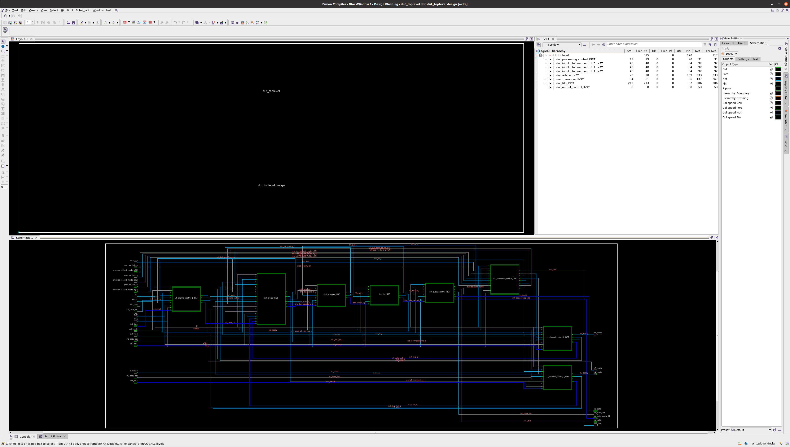
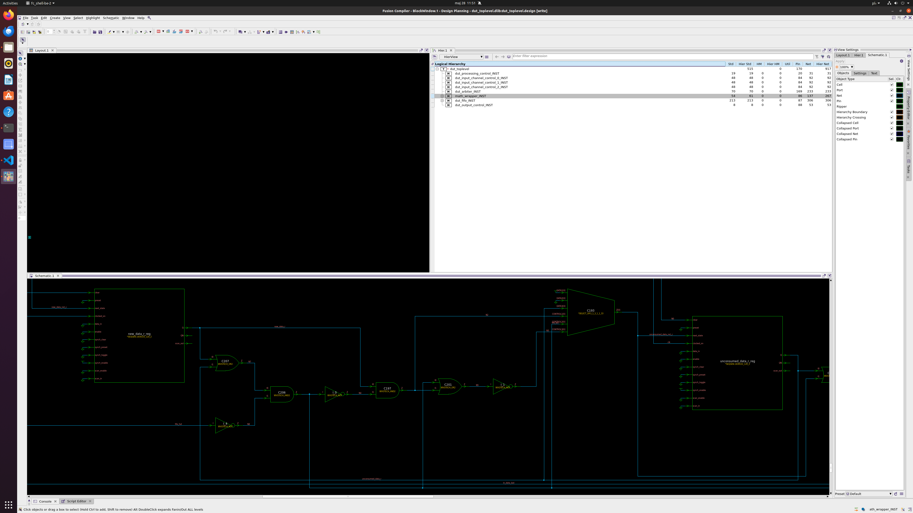
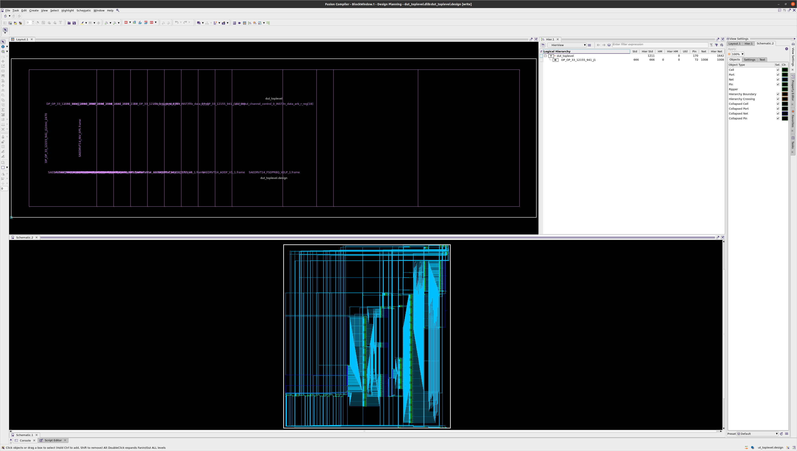
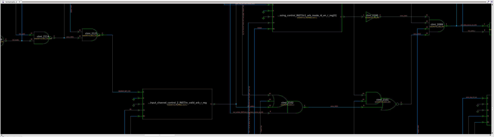

---
# pandoc report.md --lua-filter ../pandoc-include-code-files/include-code-files.lua report.pdf

# Metadata
title: Advanced ASIC Design
subtitle: "Exercise no 3: Fusion Compiler --- synthesis and top-down implementation"
author: Krzysztof Dziembała
date: "2025-06-04"

# Pandoc document settings
lang: en-GB
# Pandoc LaTeX variables
geometry: [a4paper, bindingoffset=0mm, inner=30mm, outer=30mm, top=30mm, bottom=30mm]
documentclass: report
fontsize: 12pt
colorlinks: true
numbersections: true
toc: true
lof: true # List of figures

header-includes:
  # # TikZ-timing package for timing diagrams
  # - |
  #   ````{=latex}
  #   \usepackage{tikz-timing}
  #   ````
  # # TikZ-timing: set background for D (data) to the same as on the lecture slides #FFFFCC
  # - |
  #   ````{=latex}
  #   \tikzset{timing/d/background/.style={fill={rgb,255:red,255; green,255; blue,204}}}
  #   ````
  # Remove "Chapter N" from the line above chapter name in report class document
  # I could not include a file for some reason, but this works
  - |
    ````{=latex}
    \usepackage{titlesec}
    \titleformat{\chapter}
      {\normalfont\LARGE\bfseries}{\thechapter.}{1em}{}
    \titlespacing*{\chapter}{0pt}{3.5ex plus 1ex minus .2ex}{2.3ex plus .2ex}
    ````
  # Keep footnote numbering
  - |
    ````{=latex}
    \counterwithout{footnote}{chapter}
    ````
  # Packages required for Logisim tables
  # - |
  #   ````{=latex}
  #   \usepackage{colortbl}
  #   \usepackage[dvipsnames]{xcolor}
  #   \usepackage{tikz-timing}
  #   \usepackage{tikz}
  #   \usetikzlibrary{karnaugh}
  #   ````
  # Wrap long source code lines and set smaller code font size
  - |
    ````{=latex}
    \usepackage{fvextra}
    \DefineVerbatimEnvironment{Highlighting}{Verbatim}{breaklines,breakanywhere,  fontsize=\footnotesize,commandchars=\\\{\}}
    ````
  # Allow hyphenation in `monospaced` text
  # - |
  #   ````{=latex}
  #   \usepackage[htt]{hyphenat}
  #   ````
  # Don't start chapter on new page (remove clearpage)
  # - |
  #   ````{=latex}
  #   \usepackage{etoolbox}
  #   \makeatletter
  #   \patchcmd{\chapter}{\if@openright\cleardoublepage\else\clearpage\fi}{}{}{}
  #   \makeatother
  #   ````
  # SI units
  - |
    ````{=latex}
    \usepackage{siunitx}
    ````
  # Landscape/horizontal pages, if pandoc does not see \begin and \end, it will still process everything inside as markdown
  - |
    ````{=latex}
    \usepackage{pdflscape}
    \newcommand{\blandscape}{\begin{landscape}}
    \newcommand{\elandscape}{\end{landscape}}
    ````
---

<!-- Tasks start from number 3, so manually change chapter numbering -->
<!-- \setcounter{chapter}{1} -->

<!-- markdownlint-disable MD025 -->
# Initial synthesis and optimisation

## Adding VDD and VSS

VDD abd VSS inputs must be added to all modules to serve as power and ground.

```diff
diff --git a/Lab_3/asic_lab3/src/rtl/sverilog/dut_arbiter.sv b/Lab_3/asic_lab3/src/rtl/sverilog/dut_arbiter.sv
index 117b916..cebd394 100644
--- a/Lab_3/asic_lab3/src/rtl/sverilog/dut_arbiter.sv
+++ b/Lab_3/asic_lab3/src/rtl/sverilog/dut_arbiter.sv
@@ -66,7 +66,10 @@ module dut_arbiter #(
   output logic[IN_INTERFACE_ID_WIDTH-1:0]   arb_data_source_id,
   output logic                              arb_data_last,
   output logic                              arb_data_valid,
-  input logic                               arb_data_ready
+  input logic                               arb_data_ready,
+
+  input logic VDD,
+  input logic VSS
 );

   //===========================================================================
diff --git a/Lab_3/asic_lab3/src/rtl/sverilog/dut_fifo.sv b/Lab_3/asic_lab3/src/rtl/sverilog/dut_fifo.sv
index cd0412f..c662848 100644
--- a/Lab_3/asic_lab3/src/rtl/sverilog/dut_fifo.sv
+++ b/Lab_3/asic_lab3/src/rtl/sverilog/dut_fifo.sv
@@ -44,7 +44,10 @@ module dut_fifo #(
   // read interface
   input logic fifo_re,
   output logic[FIFO_WIDTH-1:0] fifo_rdata,
-  output logic fifo_empty
+  output logic fifo_empty,
+
+  input logic VDD,
+  input logic VSS
 );

   // other local parameters
diff --git a/Lab_3/asic_lab3/src/rtl/sverilog/dut_input_channel_control.sv b/Lab_3/asic_lab3/src/rtl/sverilog/dut_input_channel_control.sv
index 178df2a..290936e 100644
--- a/Lab_3/asic_lab3/src/rtl/sverilog/dut_input_channel_control.sv
+++ b/Lab_3/asic_lab3/src/rtl/sverilog/dut_input_channel_control.sv
@@ -43,7 +43,10 @@ module dut_input_channel_control #(
   output logic                               in_valid_arb,                         // valid flag
   output logic              [DATA_WIDTH-1:0] in_data_arb,                          // data
   output logic                               in_data_last_arb,                      // indicator of last data in a frame
-  input logic                                arb_in_transferring            // indicator of arbitrating of a transfer from the input interface 0
+  input logic                                arb_in_transferring,            // indicator of arbitrating of a transfer from the input interface 0
+
+  input logic VDD,
+  input logic VSS
 );

   //===========================================================================
diff --git a/Lab_3/asic_lab3/src/rtl/sverilog/dut_math_wrapper.sv b/Lab_3/asic_lab3/src/rtl/sverilog/dut_math_wrapper.sv
index 9afe0be..8148c73 100644
--- a/Lab_3/asic_lab3/src/rtl/sverilog/dut_math_wrapper.sv
+++ b/Lab_3/asic_lab3/src/rtl/sverilog/dut_math_wrapper.sv
@@ -20,7 +20,10 @@ module dut_math_wrapper #(
   //output interface:
   output logic            [FIFO_WIDTH-1:0] fifo_data,
   output logic                             fifo_we,
-  input  logic                             fifo_full
+  input  logic                             fifo_full,
+
+  input logic VDD,
+  input logic VSS
 );


@@ -58,7 +61,9 @@ module dut_math_wrapper #(
   dut_multiplier_18x18_comb dut_multiplier_18x18_comb_inst (
   .a(in_a_c),
   .b(in_b_c),
-  .result(prod_c)
+  .result(prod_c),
+  .VDD(VDD),
+  .VSS(VSS)
   );

   // handshake logic
diff --git a/Lab_3/asic_lab3/src/rtl/sverilog/dut_multiplier_18x18_comb.sv b/Lab_3/asic_lab3/src/rtl/sverilog/dut_multiplier_18x18_comb.sv
index 2092724..670b912 100644
--- a/Lab_3/asic_lab3/src/rtl/sverilog/dut_multiplier_18x18_comb.sv
+++ b/Lab_3/asic_lab3/src/rtl/sverilog/dut_multiplier_18x18_comb.sv
@@ -1,7 +1,10 @@
 module dut_multiplier_18x18_comb (
   input  logic[17:0] a,
   input  logic[17:0] b,
-  output logic[35:0] result
+  output logic[35:0] result,
+
+  input logic VDD,
+  input logic VSS
 );

   //===========================================================================
@@ -32,29 +35,33 @@ module dut_multiplier_18x18_comb (
   dut_multiplier_9x9_comb mult_a0b0 (
     .a(a_0),
     .b(b_0),
-    .product(prd_a0_b0)
-
+    .product(prd_a0_b0),
+    .VDD(VDD),
+    .VSS(VSS)
   );

   dut_multiplier_9x9_comb mult_a1b0 (
     .a(a_1),
     .b(b_0),
-    .product(prd_a1_b0)
-
+    .product(prd_a1_b0),
+    .VDD(VDD),
+    .VSS(VSS)
   );

   dut_multiplier_9x9_comb mult_a0b1 (
     .a(a_0),
     .b(b_1),
-    .product(prd_a0_b1)
-
+    .product(prd_a0_b1),
+    .VDD(VDD),
+    .VSS(VSS)
   );

   dut_multiplier_9x9_comb mult_a1b1 (
     .a(a_1),
     .b(b_1),
-    .product(prd_a1_b1)
-
+    .product(prd_a1_b1),
+    .VDD(VDD),
+    .VSS(VSS)
   );

   always_comb sum_of_prd = {{18{1'b0}},prd_a0_b0} +
diff --git a/Lab_3/asic_lab3/src/rtl/sverilog/dut_multiplier_9x9_comb.sv b/Lab_3/asic_lab3/src/rtl/sverilog/dut_multiplier_9x9_comb.sv
index 5f0ad6e..c6256cb 100644
--- a/Lab_3/asic_lab3/src/rtl/sverilog/dut_multiplier_9x9_comb.sv
+++ b/Lab_3/asic_lab3/src/rtl/sverilog/dut_multiplier_9x9_comb.sv
@@ -1,7 +1,10 @@
 module dut_multiplier_9x9_comb (
   input logic [8:0] a,
   input logic [8:0] b,
-  output logic [17:0] product
+  output logic [17:0] product,
+
+  input logic VDD,
+  input logic VSS
 );

  always_comb product = a*b;
diff --git a/Lab_3/asic_lab3/src/rtl/sverilog/dut_output_control.sv b/Lab_3/asic_lab3/src/rtl/sverilog/dut_output_control.sv
index ba84824..5a39e59 100644
--- a/Lab_3/asic_lab3/src/rtl/sverilog/dut_output_control.sv
+++ b/Lab_3/asic_lab3/src/rtl/sverilog/dut_output_control.sv
@@ -47,7 +47,10 @@ module dut_output_control #(
   output logic             [DATA_WIDTH-1:0] out_data,
   output logic  [IN_INTERFACE_ID_WIDTH-1:0] out_data_source_id,
   output logic                              out_data_last,
-  output logic                              out_last_data_sent              // indicator that last output data has been sent out in a given frame - register
+  output logic                              out_last_data_sent,              // indicator that last output data has been sent out in a given frame - register
+
+  input logic VDD,
+  input logic VSS
 );

   //===========================================================================
diff --git a/Lab_3/asic_lab3/src/rtl/sverilog/dut_processing_control.sv b/Lab_3/asic_lab3/src/rtl/sverilog/dut_processing_control.sv
index 92f88c1..1f38af5 100644
--- a/Lab_3/asic_lab3/src/rtl/sverilog/dut_processing_control.sv
+++ b/Lab_3/asic_lab3/src/rtl/sverilog/dut_processing_control.sv
@@ -56,7 +56,10 @@ module dut_processing_control #(
   output logic                              in2_arb_mode_id_en,

   // first cycle indicator
-  output logic                              first_cycle_of_proc_req
+  output logic                              first_cycle_of_proc_req,
+
+  input logic VDD,
+  input logic VSS
 );

   //===========================================================================
diff --git a/Lab_3/asic_lab3/src/rtl/sverilog/dut_toplevel.sv b/Lab_3/asic_lab3/src/rtl/sverilog/dut_toplevel.sv
index 794a020..f73b124 100644
--- a/Lab_3/asic_lab3/src/rtl/sverilog/dut_toplevel.sv
+++ b/Lab_3/asic_lab3/src/rtl/sverilog/dut_toplevel.sv
@@ -65,7 +65,10 @@ module dut_toplevel #(
   input logic                               out_ready,                         // ready flag
   output logic             [DATA_WIDTH-1:0] out_data,                          // data
   output logic  [IN_INTERFACE_ID_WIDTH-1:0] out_data_source_id,                // source ID (indicator of an input interface from which the data is taken)
-  output logic                              out_data_last                      // indicator of last data in a frame
+  output logic                              out_data_last,                      // indicator of last data in a frame
+
+  input logic VDD,
+  input logic VSS
 );

   //===========================================================================
@@ -183,7 +186,10 @@ module dut_toplevel #(
     .in1_arb_mode_id_en                (in1_arb_mode_id_en_c),
     .in2_arb_mode_id_en                (in2_arb_mode_id_en_c),

-    .first_cycle_of_proc_req           (first_cycle_of_proc_req_c)
+    .first_cycle_of_proc_req           (first_cycle_of_proc_req_c),
+
+    .VDD(VDD),
+    .VSS(VSS)

   );

@@ -209,7 +215,10 @@ module dut_toplevel #(
     .in_valid_arb                      (in0_valid_c),
     .in_data_arb                       (in0_data_c),
     .in_data_last_arb                  (in0_data_last_c),
-    .arb_in_transferring               (arb_in0_transferring_c)
+    .arb_in_transferring               (arb_in0_transferring_c),
+
+    .VDD(VDD),
+    .VSS(VSS)
   );

   //===========================================================================
@@ -234,7 +243,10 @@ module dut_toplevel #(
     .in_valid_arb                      (in1_valid_c),
     .in_data_arb                       (in1_data_c),
     .in_data_last_arb                  (in1_data_last_c),
-    .arb_in_transferring               (arb_in1_transferring_c)
+    .arb_in_transferring               (arb_in1_transferring_c),
+
+    .VDD(VDD),
+    .VSS(VSS)
   );

   //===========================================================================
@@ -259,7 +271,10 @@ module dut_toplevel #(
     .in_valid_arb                      (in2_valid_c),
     .in_data_arb                       (in2_data_c),
     .in_data_last_arb                  (in2_data_last_c),
-    .arb_in_transferring               (arb_in2_transferring_c)
+    .arb_in_transferring               (arb_in2_transferring_c),
+
+    .VDD(VDD),
+    .VSS(VSS)
   );

   //===========================================================================
@@ -307,7 +322,10 @@ module dut_toplevel #(
     .arb_data_source_id                (arb_data_source_id_c),
     .arb_data_last                     (arb_data_last_c),
     .arb_data_valid                    (arb_data_valid_c),
-    .arb_data_ready                    (arb_data_ready_c)
+    .arb_data_ready                    (arb_data_ready_c),
+
+    .VDD(VDD),
+    .VSS(VSS)
   );

   //===========================================================================
@@ -331,7 +349,10 @@ module dut_toplevel #(
     //output interface:
     .fifo_data                         (fifo_wdata_c),
     .fifo_we                           (fifo_we_c),
-    .fifo_full                         (fifo_full_c)
+    .fifo_full                         (fifo_full_c),
+
+    .VDD(VDD),
+    .VSS(VSS)
   );

   //===========================================================================
@@ -352,7 +373,10 @@ module dut_toplevel #(

     .fifo_re                           (fifo_re_c),
     .fifo_rdata                        (fifo_rdata_packed_c),
-    .fifo_empty                        (fifo_empty_c)
+    .fifo_empty                        (fifo_empty_c),
+
+    .VDD(VDD),
+    .VSS(VSS)
     );


@@ -377,7 +401,10 @@ module dut_toplevel #(
     .out_data                          (out_data_c),
     .out_data_source_id                (out_data_source_id_c),
     .out_data_last                     (out_data_last_c),
-    .out_last_data_sent                (out_last_data_sent_c)              // indicator that last output data has been sent out in a given frame - register
+    .out_last_data_sent                (out_last_data_sent_c),              // indicator that last output data has been sent out in a given frame - register
+
+    .VDD(VDD),
+    .VSS(VSS)
   );

   //===========================================================================
```

## Creating technology library

Running `create_lib`, followed by `report_ref_libs` produces the following output:

```text
fc_shell> create_lib ${ResultsDir}/${DesignLibrary} -technology $TechFile -ref_libs ${RefLib}
Information: Loading technology file '/eda/synopsys/files/FC_Labs/common/tf/saed14nm_1p9m.tf' (FILE-007)
{dut_toplevel.dlib}
fc_shell> report_ref_libs
****************************************
Report : Reference Library Report
Library: dut_toplevel.dlib
Version: V-2023.12
Date   : Wed May 28 13:37:30 2025
****************************************

    Name                   Path                                                              Location
    -------------------------------------------------------------------------------------------------
*+  saed14rvt_frame_timing /eda/synopsys/files/FC_Labs/common/ndm/saed14rvt_frame_timing.ndm /eda/synopsys/files/FC_Labs/common/ndm/saed14rvt_frame_timing.ndm
    "*" = Library currently open
    "+" = Library has technology information
1
```

## Alalysis and elaboration

For analysis and elaboration to succeeded, `dut_params_pkg.sv` must be removed, because it conflicts with `dut_params_pkg.svh`.

Elaborated project has hierarchy (Fig. \ref{fig-elaborated-top}) and is represented using technology-independent elements (Fig. \ref{fig-elaborated-arbiter}) from `WVGTECH` library (Fig. \ref{fig-elaborated-gates}). At this stage, layout does not contain anything useful.






## Initial technology mapping

After the `initial_map` step of compilation, the hierarchy is flattened (Fig. \ref{fig-init-map}), layout is populated with lots of overlapping cells (Fig. \ref{fig-init-map}) and elements in layout use elements available in the provided technology library (Fig. \ref{fig-init-map-gates}).





### Basic parameters after initial mapping

Because there is no constraint information at this point, reports generated at this point are not useful. `report_timing`, for example, prints only

> No paths.

Power report produces output, but makes assumptions about voltage (\qty{0.7}{\volt}), temperature (\qty{125}{\degreeCelsius}) and clock (\qty{1}{\GHz}). Reported total power is \qty{3.57e+07}{\pico\watt}, including:

- Total dynamic power: \qty{1.23e+07}{\pico\watt}
  - Cell internal power: \qty{9.17e+06}{\pico\watt}
  - Net switching power: \qty{3.12e+06}{\pico\watt}
- Cell leakage power: \qty{2.34e+07}{\pico\watt}

Power distribution between sequential and combinational parts of the circuit is almost 50/50 (50.4% sequential, 49.6% combinational). Sequential group has higher internal power, while combinational uses more switching and leakage power.

Reported cell area is 906.51, 475.39 is combinational area, 431.12 noncombinational and remaining 10.30 is used by buffers and inverters. The circuit has 1211 cells (872 combinational and 339 sequential), 1714 nets and 58 buffers/inverters.

### Netlist

The generated netlist contains modules `dut_toplevel` and `DP_OP_33_12155_941_J3_H2_D0`, which. with the exception of `dut_toplevel` instantiating `DP_OP_33_12155_941_J3_H2_D0`, contain a couple of wires and lots of elements from SADRVT14 library, connected using implicit wires.

The fragment of netlist presented below, shows 2 inverters (`SAEDRVT14_INV_0P5`), 2 half adders (`SAEDRVT14_ADDH_0P5`) and 1 full adder (`SAEDRVT14_ADDF_V1_1`), all using library elements:

```{.verilog .numberLines include="asic_lab3/lab/results/dut_toplevel_initial_synthesis.v" startLine=769 endLine=776}
```

# Compilation with constraints

Because `mcmm_setup.tcl` calls `current_mode` and constraints apply to mode, the `read_sdc` command must be executed after sourcing `mcmm_setup.tcl`, to make sure that constraints apply to the _Normal_ mode and _Normal\_Typical_ scenario.

## Observed layout changes

The cell layout changes as follows:

1. After `initial_map` all cells are overlapping like shown previously on Fig. \ref{fig-init-map}.
2. `logic_opto` creates rectangular chip area and rougly places cells. Many are overlapping and there are no clear rows. (Fig. \ref{fig-layout-logic_opto})
3. `initial_place` significantly reorganises cell layout and makes rows slightly more visible. There are still many overlapping cells. (Fig. \ref{fig-layout-initial_place})
4. `initial_drc` does not move any of the existing cells, but adds buffer cells (`SAEDRVT14_BUF_8`).
5. `initial_opto` places the cells in rows and elimiates overlaps. (Fig. \ref{fig-layout-initial_opto})
6. `final_place` moves lots of cells, but still keeps them in rows and groups of cells visible after `initial_opto` stay in similar places. (Fig. \ref{fig-layout-final_place})
7. `final_opto` moves some cells, but there aren't significant differences from `final_place`. (Fig. \ref{fig-layout-final_opto})


## Report analysis and parameter comparison

The Table \ref{table-params-compilation} presents a comparison of select parameters from reports after different compilation stages. Analysis of these results shows that `initial_map` has no chip area, as [observed above](#initial-technology-mapping), so power and timing details may be very inaccurate.

`initial_drc`, unlike other stages, makes most parameters worse, because it only adds buffers to help with high-fanout nets. All other stages reduce power - both leakage and dynamic, which is 2 orders of magnitude greater. Cell area and cell count are in general reduced as the synthesis progresses, except for `inital_drc` and `initial_opto`, which increases those, while reducing power (especially leakage) and levels of logic.

Timing is improved only in `initial_place` and `final_opto` stages, both times by \qty{0.02}{\ns}. All other stages increase the critical path length. While it may seem counterintuitive, the most likely reason is that the constraints are already met, so the compiler can improve other features (power) instead. Constraints specify the clock period as \qty{3}{\ns}, but the slack always stays above \qty{1.5}{\ns}! This means that the clock could be easily doubled from \qty{333.3}{\MHz} to \qty{666.6}{\MHz} or even more without resynthesizing the circuit. Given way faster clock, the synthesis stages may behave differently and improve timing, while sacrificing e.g. power.

An interesing parameter reported in QoR is _Nets with violations_ in _Design Rules_ section (`report_qor -include electrical_drc`), shown in the table as _Nets with DRC violations_. I could not find any details about what exactly these violations are and the documentation does not mention it either.

Legality check done using `check_legality` reports no violations and finishes successfully.

\newgeometry{a4paper, bindingoffset=0mm, inner=30mm, outer=30mm, top=20mm, bottom=20mm}
\blandscape
\vspace*{\fill}

| Parameter | initial_map | logic_opto | initial_place | initial_drc | initial_opto | final_place | final_opto |
| -- | - | - | - | - | - | - | - |
| **Total power (\unit{\pico\watt})** | \num{3.57E+7} | \num{4.13E+7} | \num{4.09E+7} | \num{4.43E+7} | \num{4.41E+7} | \num{4.39E+7} | \num{4.36E+7} |
| **- Dynamic power (\unit{\pico\watt})** | \num{3.53E+7} | \num{4.10E+7} | \num{4.05E+7} | \num{4.40E+7} | \num{4.38E+7} | \num{4.36E+7} | \num{4.33E+7} |
| **- Leakage power (\unit{\pico\watt})** | \num{3.68E+5} | \num{3.24E+5} | \num{3.24E+5} | \num{3.41E+5} | \num{3.12E+5} | \num{3.12E+5} | \num{3.12E+5} |
| **Critical path length (\unit{\ns})** | \num{0.98} | \num{1.30} | \num{1.28} | \num{1.29} | \num{1.36} | \num{1.43} | \num{1.41} |
| **Worst setup slack (\unit{\ns})** | \num{2.01} | \num{1.68} | \num{1.70} | \num{1.69} | \num{1.62} | \num{1.55} | \num{1.57} |
| **Worst hold slack (\unit{\ns})** | \num{0.03} | \num{0.03} | \num{0.03} | \num{0.03} | \num{0.03} | \num{0.03} | \num{0.03} |
| **Chip area** | \num{0.000} | \num{1270.506} | \num{1270.506} | \num{1270.506} | \num{1270.506} | \num{1270.506} | \num{1270.506} |
| **Total cell area** | \num{906.69} | \num{904.25} | \num{904.25} | \num{915.13} | \num{915.97} | \num{915.00} | \num{914.51} |
| **- Combinational area** | \num{475.57} | \num{473.13} | \num{473.13} | \num{484.00} | \num{484.85} | \num{483.87} | \num{483.38} |
| **- Noncombinational area** | \num{431.12} | \num{431.12} | \num{431.12} | \num{431.12} | \num{431.12} | \num{431.12} | \num{431.12} |
| **Number of nets** | 1716 | 1608 | 1608 | 1621 | 1646 | 1646 | 1645 |
| **Number of cells** | 1213 | 1177 | 1177 | 1190 | 1216 | 1214 | 1213 |
| **- Number of buffers** | 0 | 0 | 0 | 13 | 13 | 13 | 13 |
| **- Number of inverters** | 59 | 23 | 23 | 23 | 21 | 21 | 21 |
| **Levels of logic** | 48 | 48 | 48 | 48 | 47 | 47 | 47 |
| **Nets with DRC violations** | 38 | 1 | 2 | 1 | 5 | 13 | 11 |

Table: Comparison of select reported parameters from subsequent compilation stages.\label{table-params-compilation}

\vspace*{\fill}
\elandscape
\restoregeometry

# Final scripts and constraints

## `lab/task1/scripts/task1.tcl`

```{.tcl .numberLines include="asic_lab3/lab/task1/scripts/task1.tcl"}
```

## `lab/setup/mcmm_setup.tcl`

```{.tcl .numberLines include="asic_lab3/lab/setup/mcmm_setup.tcl"}
```

## `lab/setup/utilities.tcl`

```{.tcl .numberLines include="asic_lab3/lab/setup/utilities.tcl"}
```

## `src/sdc/dut_toplevel.sdc`

```{.tcl .numberLines include="asic_lab3/src/sdc/dut_toplevel.sdc"}
```
