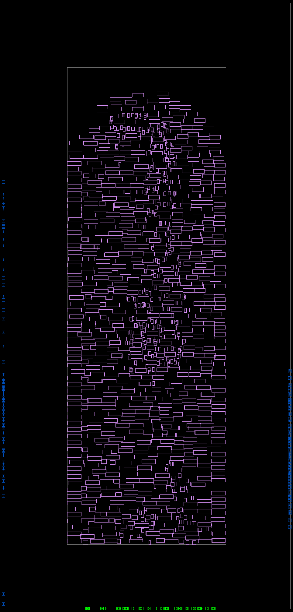
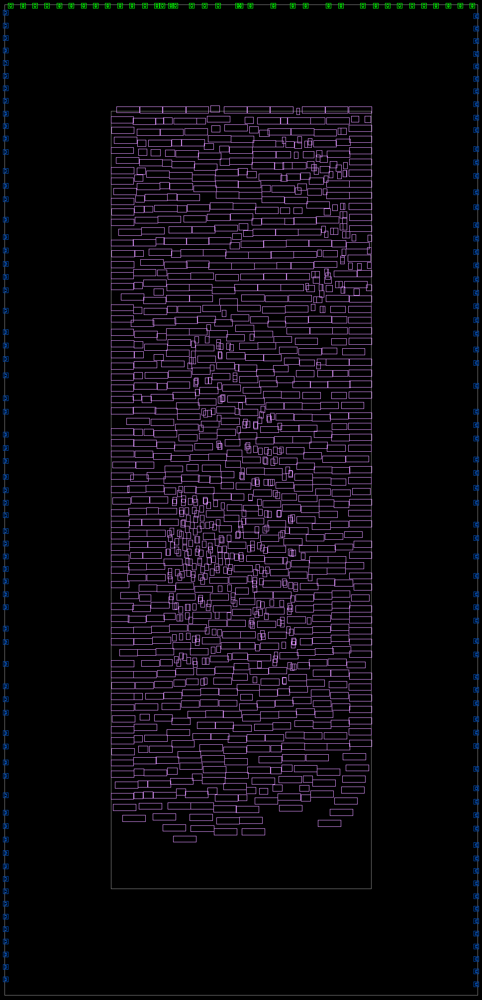
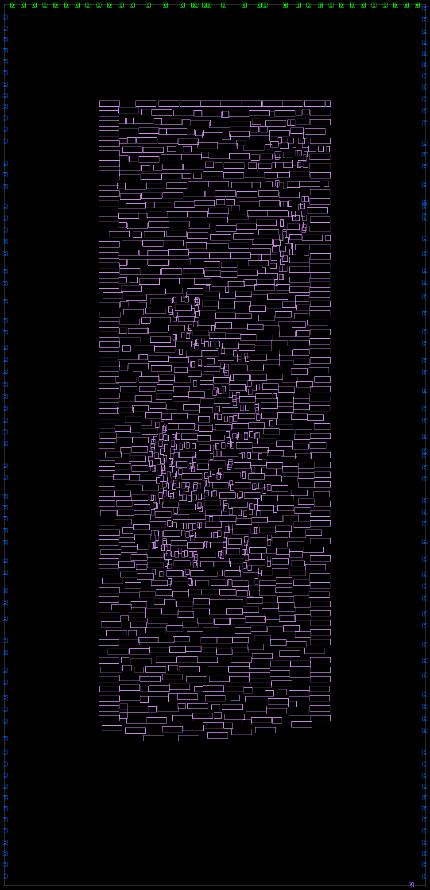
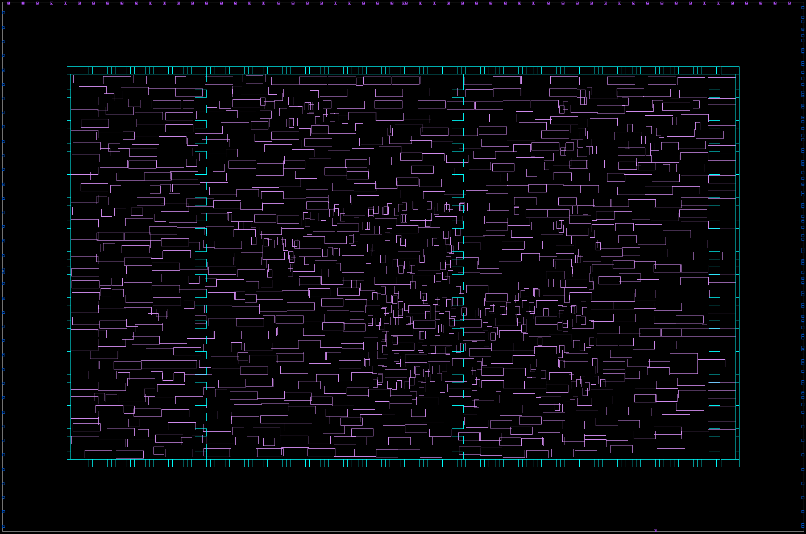
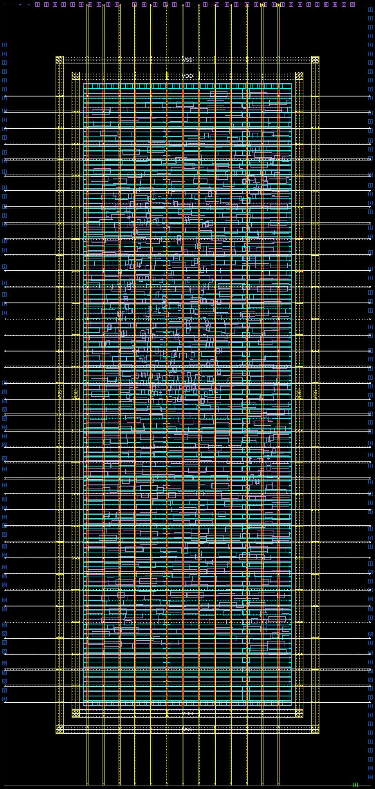

---
# pandoc report.md --lua-filter ../pandoc-include-code-files/include-code-files.lua report.pdf

# Metadata
title: Advanced ASIC Design
subtitle: "Exercise no 4: Fusion Compiler --- synthesis and top-down implementation"
author: Krzysztof Dziembała
date: "2025-06-11"

# Pandoc document settings
lang: en-GB
# Pandoc LaTeX variables
geometry: [a4paper, bindingoffset=0mm, inner=30mm, outer=30mm, top=30mm, bottom=30mm]
documentclass: report
fontsize: 12pt
colorlinks: true
numbersections: true
toc: true
lof: true # List of figures

header-includes:
  # # TikZ-timing package for timing diagrams
  # - |
  #   ````{=latex}
  #   \usepackage{tikz-timing}
  #   ````
  # # TikZ-timing: set background for D (data) to the same as on the lecture slides #FFFFCC
  # - |
  #   ````{=latex}
  #   \tikzset{timing/d/background/.style={fill={rgb,255:red,255; green,255; blue,204}}}
  #   ````
  # Remove "Chapter N" from the line above chapter name in report class document
  # I could not include a file for some reason, but this works
  - |
    ````{=latex}
    \usepackage{titlesec}
    \titleformat{\chapter}
      {\normalfont\LARGE\bfseries}{Task \thechapter.}{1em}{}
    \titlespacing*{\chapter}{0pt}{3.5ex plus 1ex minus .2ex}{2.3ex plus .2ex}
    ````
  # Keep footnote numbering
  - |
    ````{=latex}
    \counterwithout{footnote}{chapter}
    ````
  # Packages required for Logisim tables
  # - |
  #   ````{=latex}
  #   \usepackage{colortbl}
  #   \usepackage[dvipsnames]{xcolor}
  #   \usepackage{tikz-timing}
  #   \usepackage{tikz}
  #   \usetikzlibrary{karnaugh}
  #   ````
  # Wrap long source code lines and set smaller code font size
  - |
    ````{=latex}
    \usepackage{fvextra}
    \DefineVerbatimEnvironment{Highlighting}{Verbatim}{breaklines,breaknonspaceingroup,breakafter={/-_},fontsize=\footnotesize,commandchars=\\\{\}}
    ````
  # Allow hyphenation in `monospaced` text
  # - |
  #   ````{=latex}
  #   \usepackage[htt]{hyphenat}
  #   ````
  # Don't start chapter on new page (remove clearpage)
  # - |
  #   ````{=latex}
  #   \usepackage{etoolbox}
  #   \makeatletter
  #   \patchcmd{\chapter}{\if@openright\cleardoublepage\else\clearpage\fi}{}{}{}
  #   \makeatother
  #   ````
  # SI units
  - |
    ````{=latex}
    \usepackage{siunitx}
    ````
  # Landscape/horizontal pages, if pandoc does not see \begin and \end, it will still process everything inside as markdown
  # - |
  #   ````{=latex}
  #   \usepackage{pdflscape}
  #   \newcommand{\blandscape}{\begin{landscape}}
  #   \newcommand{\elandscape}{\end{landscape}}
  #   ````
---

<!-- Tasks start from number 2, so manually change chapter numbering -->
\setcounter{chapter}{1}

<!-- markdownlint-disable MD025 -->
# Library creation

After the library is compiled `report_ref_libs` prints the following report:

```{.text .numberLines include="asic_lab4/lab/task2/work/logs/task2.log" startLine=135 endLine=149}
```

## `lab/task2/scripts/task2.tcl`

```{.tcl .numberLines include="asic_lab4/lab/task2/scripts/task2.tcl"}
```

# MCMM and different optimisation options

| Parameter | general/area/timing | power |
| -- | - | - |
| **NS Total power (\unit{\pico\watt})** | \num{4.17e+07} | \num{4.18e+07} |
| **- Dynamic power (\unit{\pico\watt})** | \num{4.17e+07} | \num{4.17e+07} |
| **- Leakage power (\unit{\pico\watt})** | \num{1.59e+04} | \num{1.39e+04} |
| **NT Total power (\unit{\pico\watt})** | \num{5.99e+07} | \num{6.01e+07} |
| **- Dynamic power (\unit{\pico\watt})** | \num{5.96e+07} | \num{5.98e+07} |
| **- Leakage power (\unit{\pico\watt})** | \num{2.87e+05} | \num{2.75e+05} |
| **NF Total/Dynamic power (\unit{\pico\watt})** | \num{1.17e+08} | \num{1.17e+08} |
| **PS Total power (\unit{\pico\watt})** | \num{8.26e+06} | \num{8.27e+06} |
| **- Dynamic power (\unit{\pico\watt})** | \num{8.24e+06} | \num{8.26e+06} |
| **- Leakage power (\unit{\pico\watt})** | \num{1.59e+04} | \num{1.39e+04} |
| **PT Total power (\unit{\pico\watt})** | \num{1.43e+07} | \num{1.43e+07} |
| **- Dynamic power (\unit{\pico\watt})** | \num{1.40e+07} | \num{1.40e+07} |
| **- Leakage power (\unit{\pico\watt})** | \num{2.87e+05} | \num{2.75e+05} |
| **PF Total/Dynamic power (\unit{\pico\watt})** | \num{4.02e+07} | \num{4.03e+07} |
| **Critical path length (\unit{\ns})** | \num{1.79} | \num{1.78} |
| **Number of violating paths** | 4 | 4 |
| **Total negative slack (\unit{\ns})** | \num{-0.21} | \num{-0.21} |
| **Worst setup slack (\unit{\ns})** | \num{-0.09} | \num{-0.08} |
| **Worst hold slack (\unit{\ns})** | \num{0.02} | \num{0.02} |
| **Chip area** | \num{1270.506} | \num{1297.368} |
| **Total cell area** | \num{904.25} | \num{909.42} |
| **- Combinational area** | \num{473.13} | \num{478.30} |
| **- Noncombinational area** | \num{431.12} | \num{431.12} |
| **Number of nets** | 1605 | 1656 |
| **Number of cells** | 1174 | 1243 |

Table: Comparison of select reported parameters using different optimisation criteria. Timing is provided for scenario Normal_Slow (setup, total slack and critical length) and Normal_Fast (hold). Power data uses N/P to denote mode and S/T/F for corners.\label{table-params-compilation}

Optimizations for area (`compile.flow.high_effort_area true`) and timing (`compile.flow.high_effort_timing 2`) compiled to `logic_opto` stage are identical to the version with those options left at default values (`false` and `0` respectively).

Setting `compile.flow.enable_power true` to enable power optimisations causes the compilation to produce different results. The design becomes bigger (greater area, more cells and nets), uses a little bit more power and has a tiny bit shorter critical path (by \qty{0.01}{\ns}). Changes on layout are also visible (compare Fig. \ref{layout-general} and Fig. \ref{layout-power}).


If full compilation is done, runs with different options set, start to show differences. Those are, however, rather small and counterintuitive --- optimising for any parameter makes it worse (e.g. only the run with `compile.flow.high_effort_timing 2` produced a single setup slack violation).

## Scripts and constraints

### `lab/setup/mcmm_setup.tcl`

```{.tcl .numberLines include="asic_lab4/lab/setup/mcmm_setup.tcl"}
```

### `src/sdc/dut_toplevel.sdc`

This file has been copied from previous laboratories.

```{.tcl .numberLines include="asic_lab4/src/sdc/dut_toplevel.sdc"}
```

### `src/sdc/dut_toplevel_common.sdc`

This file is sourced by [_normal_](#srcsdcdut_toplevel_normal.sdc) and [_power\_save_](#srcsdcdut_toplevel_power_save.sdc) constraint files, after setting up parameters.

```{.tcl .numberLines include="asic_lab4/src/sdc/dut_toplevel_common.sdc"}
```

### `src/sdc/dut_toplevel_normal.sdc`

```{.tcl .numberLines include="asic_lab4/src/sdc/dut_toplevel_normal.sdc"}
```

### `src/sdc/dut_toplevel_power_save.sdc`

```{.tcl .numberLines include="asic_lab4/src/sdc/dut_toplevel_power_save.sdc"}
```

### `lab/task3/scripts/task3_base.tcl`

This script is sourced by [_general_](#labtask3scriptstask3_general.tcl), [_timing_](#labtask3scriptstask3_timing.tcl), [_area_](#labtask3scriptstask3_area.tcl) and [_power_](#labtask3scriptstask3_power.tcl) scripts which set optimisation parameters.

```{.tcl .numberLines include="asic_lab4/lab/task3/scripts/task3_base.tcl"}
```

### `lab/task3/scripts/task3_general.tcl`

```{.tcl .numberLines include="asic_lab4/lab/task3/scripts/task3_general.tcl"}
```

### `lab/task3/scripts/task3_timing.tcl`

```{.tcl .numberLines include="asic_lab4/lab/task3/scripts/task3_timing.tcl"}
```

### `lab/task3/scripts/task3_area.tcl`

```{.tcl .numberLines include="asic_lab4/lab/task3/scripts/task3_area.tcl"}
```

### `lab/task3/scripts/task3_power.tcl`

```{.tcl .numberLines include="asic_lab4/lab/task3/scripts/task3_power.tcl"}
```

# Floorplanning

## Automatic floorplan

Running `report_app_options -non_default` after `app_options -name place.coarse.continue_on_missing_scandef -value true` and `set_app_options -name compile.auto_floorplan.enable -value true` reports only the former option being changed from default. `report_app_options compile.auto*` lists all options starting with `compile.auto` and among `compile.auto_floorplan.*` options there is none with the name `enable`. It looks like it is enabled by default with no option to disable, other than initializing floorplan manually.

It is important to run `compile_fusion`, at least to `logic_opto` after setting any constraints, or changes will not be visible.

The images below present how the floorplan changes as constraints are added:

1. The floorplan is square-looking (Fig. \ref{floorplan-auto})
2. Constraints change the shape to a rectangle that stretches vertically, has some free space and a lot of free space around the core (Fig. \ref{floorplan-auto-constrained})
3. Pins are spread apart and present on top and both sides, causing the core content to be flipped closer to new pin locations (Fig. \ref{floorplan-auto-pins})
4. A single (clk) pin appears on the bottom edge of the chip (Fig. \ref{floorplan-auto-clk})


{ width=72% }

{ width=73% }

{ width=73% }

Finally, `report_congestion -rerun_global_router` reported the following small number of congestions:

```text
****************************************
Report : congestion
Design : dut_toplevel
Version: V-2023.12
Date   : Wed Jun  4 15:46:29 2025
****************************************

Layer     |    overflow     |              # GRCs has
Name      |  total  |  max  | overflow (%)      | max overflow
---------------------------------------------------------------
Both Dirs |      52 |     1 |      52  ( 0.22%) |      52
H routing |       7 |     1 |       7  ( 0.06%) |       7
V routing |      45 |     1 |      45  ( 0.38%) |      45
```

## Manual floorplan

It is important to close the library and open again, if `initialize_floorplan` is to be used after previous compilation that used automatic floorplan, or, for some reason, automatic floorplan will still be used.



The manual floorplan is a horizontal rectangle that is stretched less than the automatic one. Like in the automatic floorplan, pins are allowed on left, top and right sides, with only clk on the bottom. This floorplan features tap cells in three columns inside and boundary/end cap cells forming a ring around the core.

## Floorplan with power networks

The last floorplan version prepared in this exercise is based on [manual floorplan](#manual-floorplan) with added power networks.



## Comparison

| Parameter | tuned automatic | manual | manual with power |
| -- | - | - | - |
| **NS Total power (\unit{\pico\watt})** | \num{4.38e+07} | \num{4.16e+07} | \num{4.23e+07} |
| **- Dynamic power (\unit{\pico\watt})** | \num{4.38e+07} | \num{4.16e+07} | \num{4.23e+07} |
| **- Leakage power (\unit{\pico\watt})** | \num{1.60e+04} | \num{1.59e+04} | \num{1.60e+04} |
| **NT Total power (\unit{\pico\watt})** | \num{6.24e+07} | \num{5.97e+07} | \num{6.06e+07} |
| **- Dynamic power (\unit{\pico\watt})** | \num{6.21e+07} | \num{5.94e+07} | \num{6.03e+07} |
| **- Leakage power (\unit{\pico\watt})** | \num{2.88e+05} | \num{2.87e+05} | \num{2.88e+05} |
| **NF Total/Dynamic power (\unit{\pico\watt})** | \num{1.20e+08} | \num{1.17e+08} | \num{1.18e+08} |
| **PS Total power (\unit{\pico\watt})** | \num{8.68e+06} | \num{8.23e+06} | \num{8.38e+06} |
| **- Dynamic power (\unit{\pico\watt})** | \num{8.67e+06} | \num{8.22e+06} | \num{8.36e+06} |
| **- Leakage power (\unit{\pico\watt})** | \num{1.60e+04} | \num{1.59e+04} | \num{1.60e+04} |
| **PT Total power (\unit{\pico\watt})** | \num{1.48e+07} | \num{1.42e+07} | \num{1.44e+07} |
| **- Dynamic power (\unit{\pico\watt})** | \num{1.45e+07} | \num{1.39e+07} | \num{1.41e+07} |
| **- Leakage power (\unit{\pico\watt})** | \num{2.88e+05} | \num{2.87e+05} | \num{2.88e+05} |
| **PF Total/Dynamic power (\unit{\pico\watt})** | \num{4.08e+07} | \num{4.02e+07} | \num{4.04e+07} |
| **Critical path length (\unit{\ns})** | \num{1.80} | \num{1.74} | \num{1.82} |
| **Number of violating paths** | 5 | 3 | 5 |
| **Total negative slack (\unit{\ns})** | \num{-0.30} | \num{-0.07} | \num{-0.38} |
| **Worst setup slack (\unit{\ns})** | \num{-0.11} | \num{-0.04} | \num{-0.13} |
| **Worst hold slack (\unit{\ns})** | \num{0.02} | \num{0.02} | \num{0.02} |
| **Chip area** | \num{4153.738} | \num{2567.502} | \num{2567.502} |
| **Core area** | \num{1798.378} | \num{1632.322} | \num{1632.322} |
| **Total cell area** | \num{905.45} | \num{904.92} | \num{905.01} |
| **- Combinational area** | \num{474.33} | \num{473.79} | \num{473.79} |
| **- Noncombinational area** | \num{431.12} | \num{431.12} | \num{431.21} |
| **Number of nets** | 1602 | 1602 | 1607 |
| **Number of cells** | 1171 | 1171 | 1174 |

Table: Comparison of select reported parameters using different floorplans. Timing is provided for scenario Normal_Slow (setup, total slack and critical length) and Normal_Fast (hold). Power data uses N/P to denote mode and S/T/F for corners.\label{table-params-floorplan}

According to the data from reports presented in Table \ref{table-params-floorplan}, the constraints used in automatic floorplan make it disadvantaged with regards to power, timing and area compared to the manual less stretched floorplan. Core area of the stretched automatic floorplan is over 10% higher than this of manual, with chip area over 61% greater. Chip area is an important factor, because it dictates how many chips can fit on a single wafer, affects yield rates and finally this translates to costs.

Adding power network results in timing and power parameters significantly worsening. It is possible that it's just a result of `compile_fusion` randomness, but this is only my speculation.

## `lab/task4/scripts/task4.tcl`

```{.tcl .numberLines include="asic_lab4/lab/task4/scripts/task4.tcl"}
```
