---
# pandoc report.md --lua-filter ../pandoc-include-code-files/include-code-files.lua report.pdf

# Metadata
title: Advanced ASIC Design
subtitle: "Exercise no 5: Fusion Compiler---synthesis and top-down implementation"
author: Krzysztof Dziembała
date: "2025-06-25"

# Pandoc document settings
lang: en-GB
# Pandoc LaTeX variables
geometry: [a4paper, bindingoffset=0mm, inner=30mm, outer=30mm, top=30mm, bottom=30mm]
documentclass: report
fontsize: 12pt
colorlinks: true
numbersections: true
toc: true
lof: true # List of figures

header-includes:
  # # TikZ-timing package for timing diagrams
  # - |
  #   ````{=latex}
  #   \usepackage{tikz-timing}
  #   ````
  # # TikZ-timing: set background for D (data) to the same as on the lecture slides #FFFFCC
  # - |
  #   ````{=latex}
  #   \tikzset{timing/d/background/.style={fill={rgb,255:red,255; green,255; blue,204}}}
  #   ````
  # Remove "Chapter N" from the line above chapter name in report class document
  # I could not include a file for some reason, but this works
  - |
    ````{=latex}
    \usepackage{titlesec}
    \titleformat{\chapter}
      {\normalfont\LARGE\bfseries}{Task \thechapter.}{1em}{}
    \titlespacing*{\chapter}{0pt}{3.5ex plus 1ex minus .2ex}{2.3ex plus .2ex}
    ````
  # Keep footnote numbering
  - |
    ````{=latex}
    \counterwithout{footnote}{chapter}
    ````
  # Packages required for Logisim tables
  # - |
  #   ````{=latex}
  #   \usepackage{colortbl}
  #   \usepackage[dvipsnames]{xcolor}
  #   \usepackage{tikz-timing}
  #   \usepackage{tikz}
  #   \usetikzlibrary{karnaugh}
  #   ````
  # Wrap long source code lines and set smaller code font size
  - |
    ````{=latex}
    \usepackage{fvextra}
    \DefineVerbatimEnvironment{Highlighting}{Verbatim}{breaklines,breaknonspaceingroup,breakafter={/-_},fontsize=\footnotesize,commandchars=\\\{\}}
    ````
  # Allow hyphenation in `monospaced` text
  # - |
  #   ````{=latex}
  #   \usepackage[htt]{hyphenat}
  #   ````
  # Don't start chapter on new page (remove clearpage)
  # - |
  #   ````{=latex}
  #   \usepackage{etoolbox}
  #   \makeatletter
  #   \patchcmd{\chapter}{\if@openright\cleardoublepage\else\clearpage\fi}{}{}{}
  #   \makeatother
  #   ````
  # SI units
  - |
    ````{=latex}
    \usepackage{siunitx}
    ````
  # Landscape/horizontal pages, if pandoc does not see \begin and \end, it will still process everything inside as markdown
  # - |
  #   ````{=latex}
  #   \usepackage{pdflscape}
  #   \newcommand{\blandscape}{\begin{landscape}}
  #   \newcommand{\elandscape}{\end{landscape}}
  #   ````
---

<!-- There will be a warning until a new version of microtype gets released: https://github.com/schlcht/microtype/issues/53 -->

<!-- markdownlint-disable MD025 -->
# Floorplan creation

- `core_utilization` is 0.65 (defined as variable `CoreUtilization`); `core_offset` is 5 (defined as variable `CoreOffset`)
- width to height core ratio is 5:3 (defined by `CoreSideRatio` 2.5 1.5)
- I/O pins are placed on left, top and right edges
- clock pin is placed on bottom edge
- I/O pins are assigned to layers M3 and M4
- clock pin is assigned to layer M5
- standard cell power and ground rails use M1 layer and run horizontally, even though the layer routing direction is defined as vertical
- power and ground rings use layers M6 (horizontal) and M7 (vertical)
- power straps use layers M5 (vertical), M6 (horizontal) and M7 (vertical)
- ground straps use layers M5 (vertical), M6 (horizontal) and M7 (vertical)

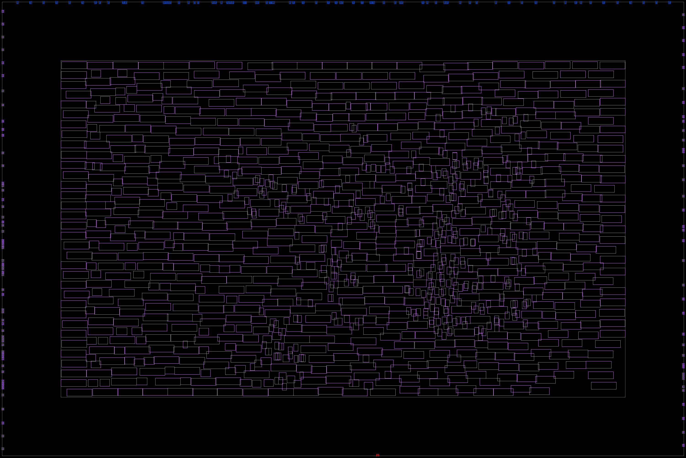

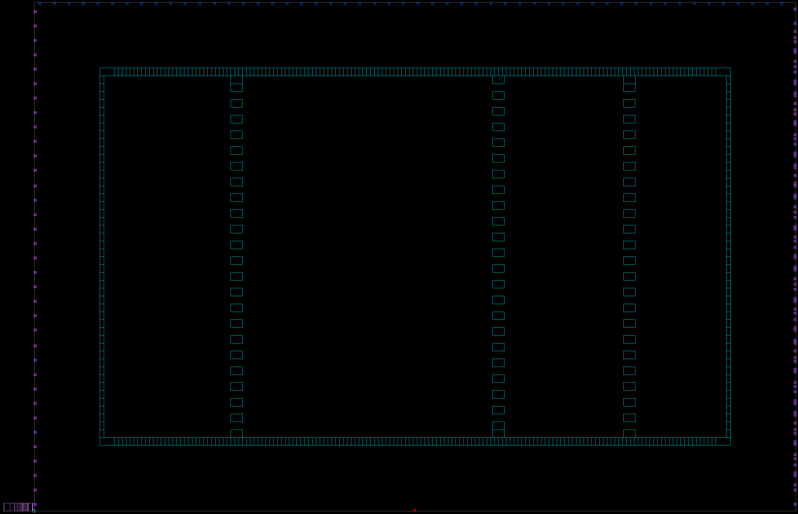

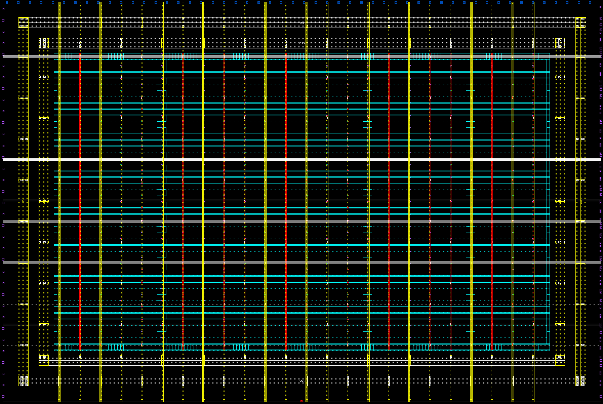

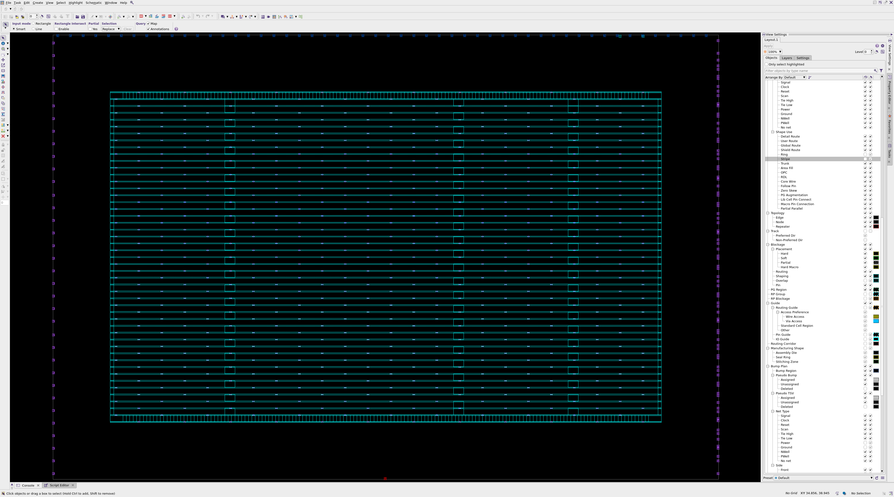

# Cell placement

Procedure `analyzeDesign`:

```{.tcl .numberLines include="asic_lab5/lab/tasks/task2/scripts/task2.tcl" startLine=13 endLine=19}
```

Procedure used for making screenshots (Figures \ref{fig-placement-classic}, \ref{fig-placement-unified} and \ref{fig-placement-blockage}):

```{.tcl .numberLines include="asic_lab5/lab/tasks/task2/scripts/task2.tcl" startLine=21 endLine=40}
```

Immediately after creating the placement blockage, `check_legality` reported 62 violations. All of them were caused by cells overlapping blockage. Later `legalize_placement -incremental` fixed all of these violations as can be seen in the Table \ref{table-placement} in column _with blockage_. `legalize_placement` warns about large displacements that could cause problems if the displaced cells are timing critical. The displacement is presented on helpful debug plots shown on Figures \ref{fig-placement-max-displacement} and \ref{fig-placement-displacement}.


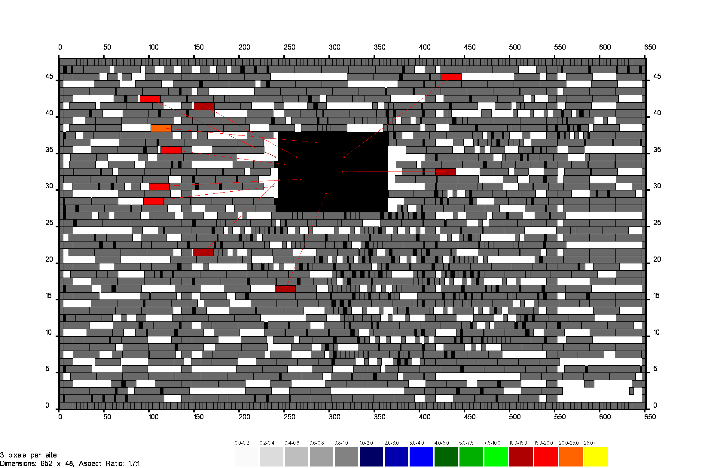

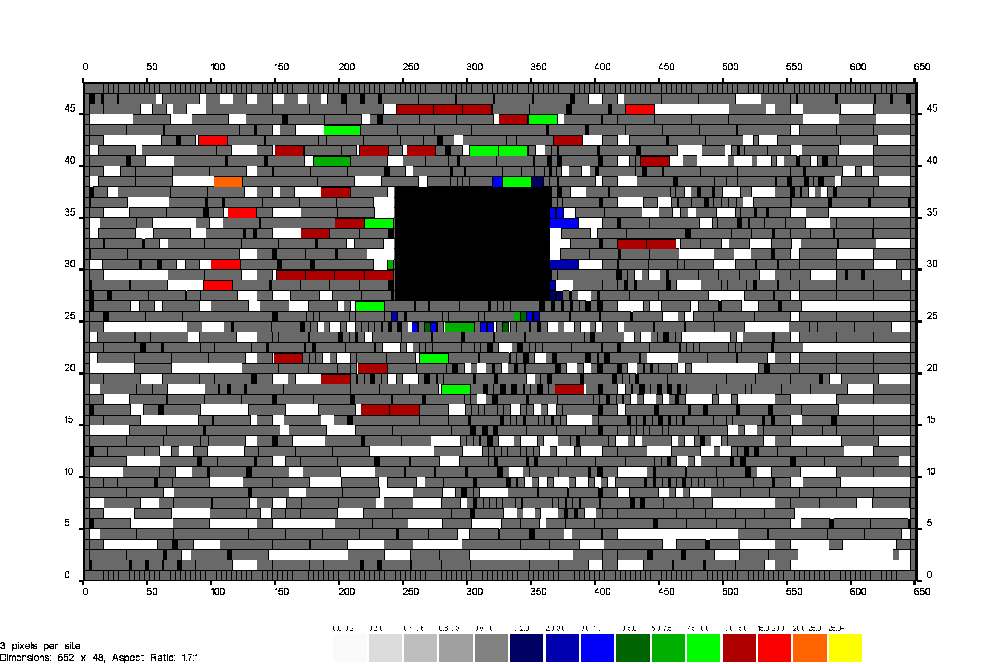

Analysis of data presented in reports (Table \ref{table-placement}) shows that the _unified placement_ entirely done by `compile_fusion` resulted in less overflow and smaller power usage (in the _Normal\_Typical_ scenario). Adding blockage and the subsequent legalisation caused the utilisation ratio to grow from approximately 66% (`core_utilization` was 0.65) to 69%, because part of the core area was excluded. Interestingly, despite increasing the total net length by over 8%, timing and power remained the same. The power report contains messages informing that the activity for all scenarios was cached and no propagation is required. This seems to suggest that the data from power report has not been updated.

Later, when the library and `placement_and_optimization` block have been opened again, running `report_power` and `report_timing` produced different results. This means that the data from "with blockage" column in Table \ref{table-placement} is partially incorrect. Comparing the plotted max delay path from Fig. \ref{fig-task2-max-delay} with displaced cells from Figures \ref{fig-placement-max-displacement} and \ref{fig-placement-displacement} shows that the displacement caused by blockage and subsequent legalisation affected cells on the longest (timing-wise) path. The updated timing report, instead of \qty{0}{\ns} positive slack, shows setup violation by \qty{0.08}{\ns}. Similarly, power characteristics are worse, because the longer net causes net switching power to rise. These updated values are presented in the column marked _(rerun)_.

| Parameter | classic | unified | with blockage | with blockage (rerun) |
| :------ | -: | -: | -: | -: |
| **Legality violations** | 0 | 0 | 0 | 0 |
| **Total overflow** | 40 | 11 | 11 | 11 |
| **Overflowing GRCs %** | \num{0.22} | \num{0.07} | \num{0.07} | \num{0.07} |
| **Utilization ratio** | \num{0.6623} | \num{0.6622} | \num{0.6920} | \num{0.6920} |
| **Chip area** | \num{2254.280} | \num{2254.280} | \num{2254.280} | \num{2254.280} |
| **Core area** | \num{1385.2800} | \num{1385.2800} | \num{1385.2800} | \num{1385.2800} |
| **- Excluded area** | \num{0.0000} | \num{0.0000} | \num{59.5848} | \num{59.5848} |
| **- Total cell area** | \num{917.4372} | \num{917.3928} | \num{917.3928} | \num{917.3928} |
| **\|  - Combinational area** | \num{486.27} | \num{486.22} | \num{486.22} | \num{486.22} |
| **\|  - Noncombinational area** | \num{431.17} | \num{431.17} | \num{431.17} | \num{431.17} |
| **Power (\unit{\pico\watt})** | \num{7.12E+7} | \num{7.08E+7} | \num{7.08E+7} | \num{7.16E+7} |
| **- Dynamic power (\unit{\pico\watt})** | \num{7.09E+7} | \num{7.05E+7} | \num{7.05E+7} | \num{7.13E+7} |
| **\|  - Cell internal power (\unit{\pico\watt})** | \num{4.77E+7} | \num{4.76E+7} | \num{4.76E+7} | \num{4.76E+7} |
| **\|  - Net switching power (\unit{\pico\watt})** | \num{2.32E+7} | \num{2.29E+7} | \num{2.29E+7} | \num{2.37E+7} |
| **- Leakage power (\unit{\pico\watt})** | \num{3.17E+5} | \num{3.16E+5} | \num{3.16E+5} | \num{3.16E+5} |
| **Critical path length (\unit{\ns})** | \num{1.73} | \num{1.78} | \num{1.78} | \num{1.87} |
| **Worst setup slack (\unit{\ns})** | \num{0.00} | \num{0.00} | \num{0.00} | \num{-0.08} |
| **Worst hold slack (\unit{\ns})** | \num{0.02} | \num{0.01} | \num{0.01} | \num{0.01} |
| **Net length** | \num{10917.79} | \num{10977.89} | \num{11891.21} | \num{11891.21} |
| **Number of nets** | 1647 | 1648 | 1648 | 1648 |
| **Number of cells** | 1215 | 1216 | 1216 | 1216 |
| **- Number of buffers** | 14 | 13 | 13 | 13 |
| **- Number of inverters** | 22 | 21 | 21 | 21 |

Table: Comparison of select parameters, depending on placement strategy. Presented power data for scenario _Normal\_Typical_. Critical path length and worst setup slack are for scenario _Normal\_Slow_. Hold slack is for the worst scenario (may differ). The _with blockage (rerun)_ column uses reports generated after closing and reopening Fusion Compiler.\label{table-placement}


# Clock tree synthesis

Script `cts_cell_usage.tcl` was prepared according to the instruction:

```{.tcl .numberLines include="asic_lab5/lab/tasks/task3/scripts/cts_cell_usage.tcl"}
```

As first noted by Mateusz during the laboratories, something seemed wrong and most of cells that were supposed to be used during CTS, could not be found in the layout. What `set_lib_cell_purpose -include cts` did was allowing those cells to be used for clock tree synthesis, but they were already allowed and so were many more cells. By default all cells have `included_purposes` `all`, which results in `valid_purposes` `{power hold cts optimization}`. This can be confirmed using attribute report (e.g. `report_attributes -nosplit -application [get_lib_cells */SAEDRVT14_BUF_16]`) or `get_attributes` with attribute names `valid_purposes`, `included_purposes` and `excluded_purposes` (e.g. `get_attribute -objects [get_lib_cells */SAEDRVT14_BUF_16] -name valid_purposes`). The actual list of cells considered for CTS (buffers, inverters and separately integrated clock gating cells) is printed by `clock_opt`:

```plain
Buffer/Inverter reference list for clock tree synthesis:
   saed14rvt_frame_timing/SAEDRVT14_BUF_10
   saed14rvt_frame_timing/SAEDRVT14_BUF_12
   saed14rvt_frame_timing/SAEDRVT14_BUF_16
   saed14rvt_frame_timing/SAEDRVT14_BUF_1P5
   saed14rvt_frame_timing/SAEDRVT14_BUF_1
   saed14rvt_frame_timing/SAEDRVT14_BUF_20
   saed14rvt_frame_timing/SAEDRVT14_BUF_2
   saed14rvt_frame_timing/SAEDRVT14_BUF_3
   saed14rvt_frame_timing/SAEDRVT14_BUF_4
   saed14rvt_frame_timing/SAEDRVT14_BUF_6
   saed14rvt_frame_timing/SAEDRVT14_BUF_8
   saed14rvt_frame_timing/SAEDRVT14_BUF_CDC_2
   saed14rvt_frame_timing/SAEDRVT14_BUF_CDC_4
   saed14rvt_frame_timing/SAEDRVT14_BUF_ECO_1
   saed14rvt_frame_timing/SAEDRVT14_BUF_ECO_2
   saed14rvt_frame_timing/SAEDRVT14_BUF_ECO_3
   saed14rvt_frame_timing/SAEDRVT14_BUF_ECO_4
   saed14rvt_frame_timing/SAEDRVT14_BUF_ECO_6
   saed14rvt_frame_timing/SAEDRVT14_BUF_ECO_7
   saed14rvt_frame_timing/SAEDRVT14_BUF_ECO_8
   saed14rvt_frame_timing/SAEDRVT14_BUF_S_0P5
   saed14rvt_frame_timing/SAEDRVT14_BUF_S_0P75
   saed14rvt_frame_timing/SAEDRVT14_BUF_S_10
   saed14rvt_frame_timing/SAEDRVT14_BUF_S_12
   saed14rvt_frame_timing/SAEDRVT14_BUF_S_16
   saed14rvt_frame_timing/SAEDRVT14_BUF_S_1P5
   saed14rvt_frame_timing/SAEDRVT14_BUF_S_1
   saed14rvt_frame_timing/SAEDRVT14_BUF_S_20
   saed14rvt_frame_timing/SAEDRVT14_BUF_S_2
   saed14rvt_frame_timing/SAEDRVT14_BUF_S_3
   saed14rvt_frame_timing/SAEDRVT14_BUF_S_4
   saed14rvt_frame_timing/SAEDRVT14_BUF_S_6
   saed14rvt_frame_timing/SAEDRVT14_BUF_S_8
   saed14rvt_frame_timing/SAEDRVT14_BUF_U_0P5
   saed14rvt_frame_timing/SAEDRVT14_BUF_U_0P75
   saed14rvt_frame_timing/SAEDRVT14_BUF_UCDC_0P5
   saed14rvt_frame_timing/SAEDRVT14_BUF_UCDC_1
   saed14rvt_frame_timing/SAEDRVT14_DEL_L4D100_1
   saed14rvt_frame_timing/SAEDRVT14_DEL_L4D100_2
   saed14rvt_frame_timing/SAEDRVT14_DEL_R2V1_1
   saed14rvt_frame_timing/SAEDRVT14_DEL_R2V1_2
   saed14rvt_frame_timing/SAEDRVT14_DEL_R2V2_1
   saed14rvt_frame_timing/SAEDRVT14_DEL_R2V2_2
   saed14rvt_frame_timing/SAEDRVT14_DEL_R2V3_1
   saed14rvt_frame_timing/SAEDRVT14_DEL_R2V3_2
   saed14rvt_frame_timing/SAEDRVT14_BUF_PECO_12
   saed14rvt_frame_timing/SAEDRVT14_BUF_PECO_1
   saed14rvt_frame_timing/SAEDRVT14_BUF_PECO_2
   saed14rvt_frame_timing/SAEDRVT14_BUF_PECO_4
   saed14rvt_frame_timing/SAEDRVT14_BUF_PECO_8
   saed14rvt_frame_timing/SAEDRVT14_BUF_PS_0P75
   saed14rvt_frame_timing/SAEDRVT14_BUF_PS_1P5
   saed14rvt_frame_timing/SAEDRVT14_BUF_PS_3
   saed14rvt_frame_timing/SAEDRVT14_BUF_PS_6
   saed14rvt_frame_timing/SAEDRVT14_DEL_PR2V2_1
   saed14rvt_frame_timing/SAEDRVT14_AOBUF_IW_0P75
   saed14rvt_frame_timing/SAEDRVT14_AOBUF_IW_1P5
   saed14rvt_frame_timing/SAEDRVT14_AOBUF_IW_3
   saed14rvt_frame_timing/SAEDRVT14_AOBUF_IW_6
   saed14rvt_frame_timing/SAEDRVT14_INV_0P5
   saed14rvt_frame_timing/SAEDRVT14_INV_0P75
   saed14rvt_frame_timing/SAEDRVT14_INV_10
   saed14rvt_frame_timing/SAEDRVT14_INV_12
   saed14rvt_frame_timing/SAEDRVT14_INV_16
   saed14rvt_frame_timing/SAEDRVT14_INV_1P5
   saed14rvt_frame_timing/SAEDRVT14_INV_1
   saed14rvt_frame_timing/SAEDRVT14_INV_20
   saed14rvt_frame_timing/SAEDRVT14_INV_2
   saed14rvt_frame_timing/SAEDRVT14_INV_3
   saed14rvt_frame_timing/SAEDRVT14_INV_4
   saed14rvt_frame_timing/SAEDRVT14_INV_6
   saed14rvt_frame_timing/SAEDRVT14_INV_8
   saed14rvt_frame_timing/SAEDRVT14_INV_ECO_1
   saed14rvt_frame_timing/SAEDRVT14_INV_ECO_2
   saed14rvt_frame_timing/SAEDRVT14_INV_ECO_3
   saed14rvt_frame_timing/SAEDRVT14_INV_ECO_4
   saed14rvt_frame_timing/SAEDRVT14_INV_ECO_6
   saed14rvt_frame_timing/SAEDRVT14_INV_ECO_8
   saed14rvt_frame_timing/SAEDRVT14_INV_S_0P5
   saed14rvt_frame_timing/SAEDRVT14_INV_S_0P75
   saed14rvt_frame_timing/SAEDRVT14_INV_S_10
   saed14rvt_frame_timing/SAEDRVT14_INV_S_12
   saed14rvt_frame_timing/SAEDRVT14_INV_S_16
   saed14rvt_frame_timing/SAEDRVT14_INV_S_1P5
   saed14rvt_frame_timing/SAEDRVT14_INV_S_1
   saed14rvt_frame_timing/SAEDRVT14_INV_S_20
   saed14rvt_frame_timing/SAEDRVT14_INV_S_2
   saed14rvt_frame_timing/SAEDRVT14_INV_S_3
   saed14rvt_frame_timing/SAEDRVT14_INV_S_4
   saed14rvt_frame_timing/SAEDRVT14_INV_S_5
   saed14rvt_frame_timing/SAEDRVT14_INV_S_6
   saed14rvt_frame_timing/SAEDRVT14_INV_S_7
   saed14rvt_frame_timing/SAEDRVT14_INV_S_8
   saed14rvt_frame_timing/SAEDRVT14_INV_S_9
   saed14rvt_frame_timing/SAEDRVT14_INV_PECO_12
   saed14rvt_frame_timing/SAEDRVT14_INV_PECO_1
   saed14rvt_frame_timing/SAEDRVT14_INV_PECO_2
   saed14rvt_frame_timing/SAEDRVT14_INV_PECO_4
   saed14rvt_frame_timing/SAEDRVT14_INV_PECO_8
   saed14rvt_frame_timing/SAEDRVT14_INV_PS_1
   saed14rvt_frame_timing/SAEDRVT14_INV_PS_2
   saed14rvt_frame_timing/SAEDRVT14_INV_PS_3
   saed14rvt_frame_timing/SAEDRVT14_INV_PS_6

ICG reference list:
   saed14rvt_frame_timing/SAEDRVT14_CKGTNLT_V5_12
   saed14rvt_frame_timing/SAEDRVT14_CKGTNLT_V5_1
   saed14rvt_frame_timing/SAEDRVT14_CKGTNLT_V5_2
   saed14rvt_frame_timing/SAEDRVT14_CKGTNLT_V5_3
   saed14rvt_frame_timing/SAEDRVT14_CKGTNLT_V5_4
   saed14rvt_frame_timing/SAEDRVT14_CKGTNLT_V5_5
   saed14rvt_frame_timing/SAEDRVT14_CKGTNLT_V5_6
   saed14rvt_frame_timing/SAEDRVT14_CKGTNLT_V5_8
   saed14rvt_frame_timing/SAEDRVT14_CKGTPLT_V5_12
   saed14rvt_frame_timing/SAEDRVT14_CKGTPLT_V5_16
   saed14rvt_frame_timing/SAEDRVT14_CKGTPLT_V5_1
   saed14rvt_frame_timing/SAEDRVT14_CKGTPLT_V5_20
   saed14rvt_frame_timing/SAEDRVT14_CKGTPLT_V5_24
   saed14rvt_frame_timing/SAEDRVT14_CKGTPLT_V5_2
   saed14rvt_frame_timing/SAEDRVT14_CKGTPLT_V5_3
   saed14rvt_frame_timing/SAEDRVT14_CKGTPLT_V5_4
   saed14rvt_frame_timing/SAEDRVT14_CKGTPLT_V5_5
   saed14rvt_frame_timing/SAEDRVT14_CKGTPLT_V5_6
   saed14rvt_frame_timing/SAEDRVT14_CKGTPLT_V5_8
   saed14rvt_frame_timing/SAEDRVT14_CKGTPL_V5_0P5
   saed14rvt_frame_timing/SAEDRVT14_CKGTPL_V5_1
   saed14rvt_frame_timing/SAEDRVT14_CKGTPL_V5_2
   saed14rvt_frame_timing/SAEDRVT14_CKGTPL_V5_4
   saed14rvt_frame_timing/SAEDRVT14_CKINVGTPLT_V7_1
   saed14rvt_frame_timing/SAEDRVT14_CKINVGTPLT_V7_2
   saed14rvt_frame_timing/SAEDRVT14_CKINVGTPLT_V7_3
   saed14rvt_frame_timing/SAEDRVT14_CKINVGTPLT_V7_4
   saed14rvt_frame_timing/SAEDRVT14_CKINVGTPLT_V7_5
   saed14rvt_frame_timing/SAEDRVT14_CKINVGTPLT_V7_6
   saed14rvt_frame_timing/SAEDRVT14_CKINVGTPLT_V7_8
```

The `set_driving_cell` command used to set attributes of the `clk` port is also used incorrectly. Documentation of this command says:

> Driving  cell data is managed on a **per-scenario basis**. For designs with
> multiple scenarios, you can specify different driving cell settings for
> different scenarios by using -modes, -corners, and -scenarios options.
>
> By default, if none of these options are specified, **the command applies**
> **to the current scenario**. The tool issues an error if there is  no  current
> scenario.  If the -scenarios option is given, the command applies
> to all of the specified scenarios.

This can be confirmed using `report_ports -drive clk` and changing scenarios:

```tcl
fc_shell> report_ports -drive clk
****************************************
Report : port
        -drive
Module : dut_toplevel
Mode   : PowerSave
Corner : Slow
Scenario: PowerSave_Slow
Version: V-2023.12
Date   : Tue Jul  1 14:42:21 2025
****************************************

            Resistance (min/max)
Input Port  Rise             Fall
--------------------------------------------------------------------------------
clk         --               --

                      Driving Cell
Input Port     Type     Cell                Mult      Clock     Attrs
--------------------------------------------------------------------------------
clk            min_rise SAEDRVT14_INV_20
clk            min_fall SAEDRVT14_INV_20
clk            max_rise SAEDRVT14_INV_20
clk            max_fall SAEDRVT14_INV_20
1
fc_shell> current_scenario Normal_Typical
{Normal_Typical}
fc_shell> report_ports -drive clk
****************************************
Report : port
        -drive
Module : dut_toplevel
Mode   : Normal
Corner : Typical
Scenario: Normal_Typical
Version: V-2023.12
Date   : Tue Jul  1 14:42:39 2025
****************************************

            Resistance (min/max)
Input Port  Rise             Fall
--------------------------------------------------------------------------------
clk         --               --
1
```

This might cause problems with parameter analysis in scenarios other than _PowerSave\_Slow_, but I did not try synthesis with `set_driving_cell -lib_cell ${CellPrefix}_INV_20 [get_ports ${ClockName}] -scenarios [all_scenarios]` to see if there are any differences.


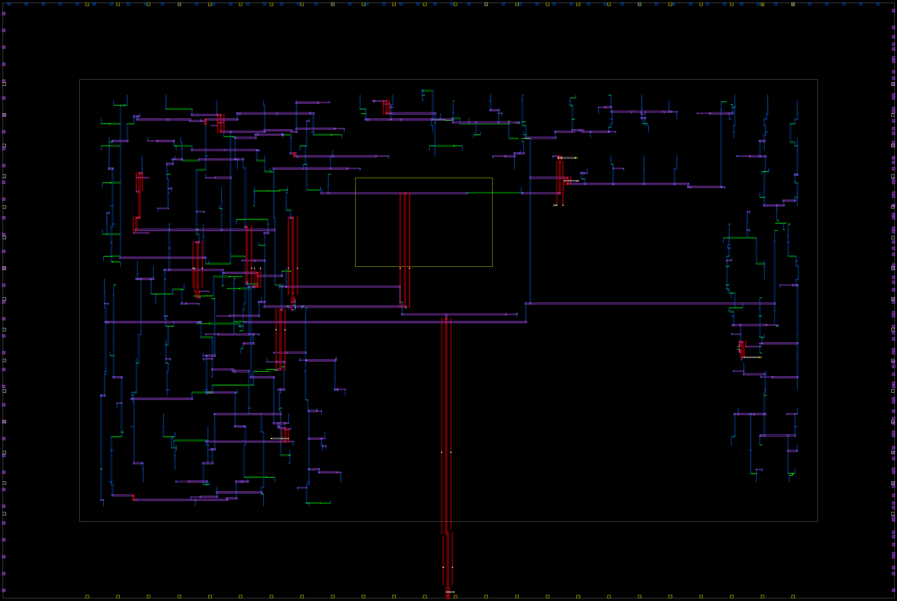

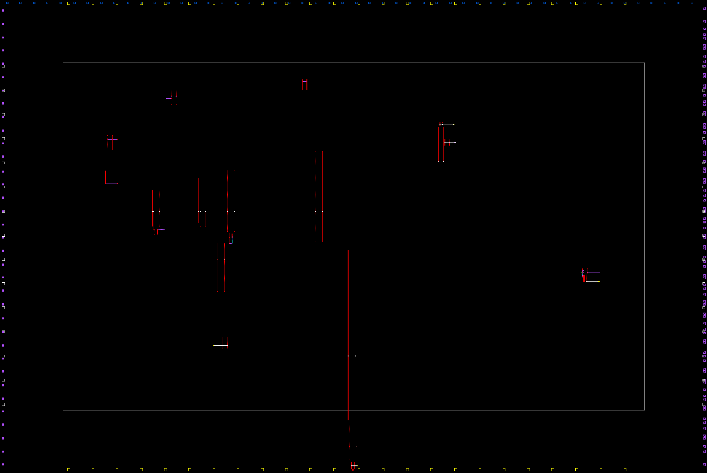

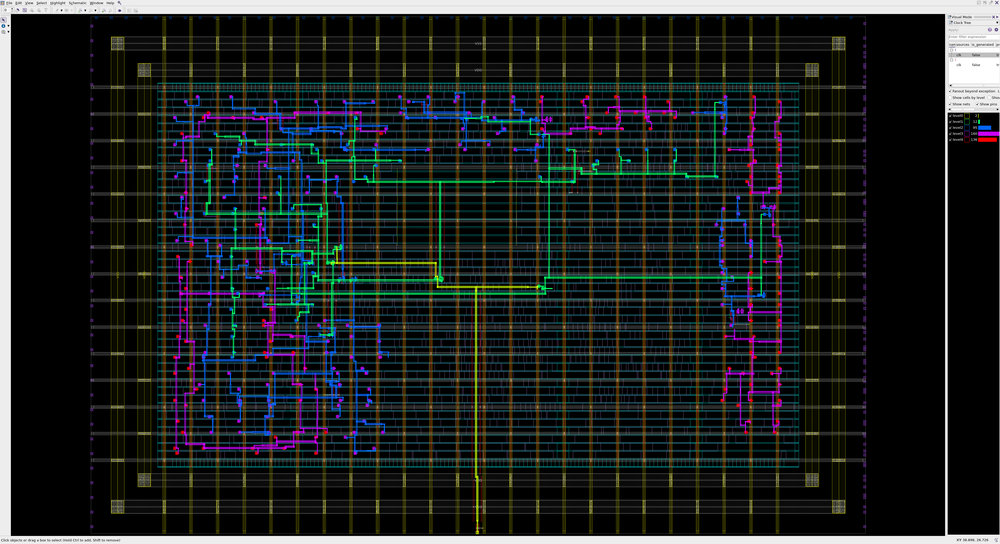

<!--
How to make 4K screenshots:
1. Start VM "OpenSUSE" and log in as "krzys"
2. (In VM) Open Remmina and choose connection "Self", which connects to localhost over RDP with custom 4K resolution
3. (In remote connection in VM) Choose user "user"
4. (On host) ssh -R 1234:labsrv26:22 user@VM
5. (In remote connection in VM, logged in as "user") ssh -X -Y -C -p 1234 student@localhost
6. From this shell run things that need GUI - it connects to labsrv26 through forwarded port, as the VM has no VPN access

Step 5. can be instead done from host's SSH connection used for port forwarding, but requires setting env variables to the same values as in remote connection e.g.:
WAYLAND_DISPLAY=wayland-0 DISPLAY=:2 XAUTHORITY=/run/user/1001/.mutter-Xwaylandauth.RH4D92 ssh -p 1234 -X -Y -C student@localhost
-->

Fig. \ref{fig-clock-shield} shows that the ground shield around clock exists mostly on M5 (vertical), but also partially in small fragments on one side of the clock on other layers (M6, M4, M3, M2, M1). Other figures show how clock is gradually being routed - starting from straight lines to finally snap to tracks of different widths.

| Parameter | clock tree synthesis |
| :--- | -: |
| **Legality violations** | 0 |
| **Total overflow** | 1 |
| **Overflowing GRCs %** | \num{0.01} |
| **Utilization ratio** | \num{0.7014} |
| **Chip area** | \num{2254.280} |
| **Core area** | \num{1385.2800} |
| **- Excluded area** | \num{59.5848} |
| **- Total cell area** | \num{929.8248} |
| **\|  - Combinational area** | \num{498.39} |
| **\|  - Noncombinational area** | \num{431.43} |
| **Power (Normal\_Typical) (\unit{\pico\watt})** | \num{6.95E+7} |
| **- Dynamic power (\unit{\pico\watt})** | \num{6.92E+7} |
| **\|  - Cell internal power (\unit{\pico\watt})** | \num{3.95E+7} |
| **\|  - Net switching power (\unit{\pico\watt})** | \num{2.97E+7} |
| **- Leakage power (\unit{\pico\watt})** | \num{3.22E+5} |
| **Critical path length (\unit{\ns})** | \num{1.67} |
| **Worst setup slack (\unit{\ns})** | \num{0.05} |
| **Worst hold slack (\unit{\ns})** | \num[retain-negative-zero]{-0.00} |
| **Net length** | \num{12218.91} |
| **Number of nets** | 1675 |
| **Number of cells** | 1251 |
| **- Number of buffers** | 36 |
| **- Number of inverters** | 23 |

Table: Circuit parameters after clock tree synthesis. Generated in the same way as Table \ref{table-placement}.\label{table-cts}

Analysis of parameters from Table \ref{table-cts} shows greately increased net length and number of buffers caused by adding the clock tree. Other changes from Table \ref{table-placement} include lower power, caused by lower cell internal power, although the net switching power increased. Timing has also improved significantly, but now instead of setup violation there is a small hold violation (rounded to \qty{0.00}{\ns}).

## Task 3 script

The script was modified to automatically make screenshots with different settings:

```{.tcl .numberLines include="asic_lab5/lab/tasks/task3/scripts/task3.tcl"}
```

# Routing

Instruction says that the script contains an example of command creating routing blockage on layers _M2_, _M3_ and _M4_ that has "?" signs, which should be replaced with placement blockage coordinates from [task 2](#cell-placement). However, the script contained a command with already filled proper coordinates and only layer _M4_. There was also a comment with "?" signs instead of coordinates and it only had _M4_ as the layer affected by blockage. Since the instruction did not ask for more changes, the commands were not modified:

```{.tcl .numberLines include="asic_lab5/lab/tasks/task4/scripts/task4.tcl" startLine=58 endLine=60}
```


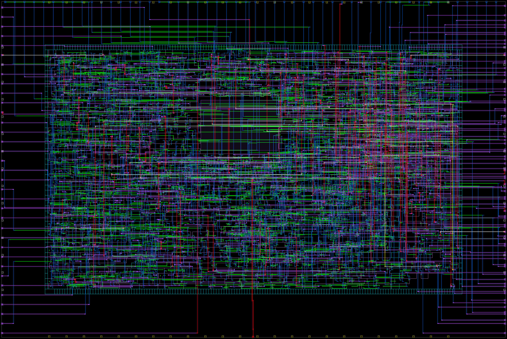

| Parameter | routing with blockage |
| :- | -: |
| **Legality violations** | 0 |
| **Total overflow** | 58 |
| **Overflowing GRCs %** | \num{0.39} |
| **Utilization ratio** | \num{0.7015} |
| **Chip area** | \num{2254.280} |
| **Core area** | \num{1385.2800} |
| **- Excluded area** | \num{59.5848} |
| **- Total cell area** | \num{930.0024} |
| **\|  - Combinational area** | \num{498.57} |
| **\|  - Noncombinational area** | \num{431.43} |
| **Power (\unit{\pico\watt})** | \num{6.88E+7} |
| **- Dynamic power (\unit{\pico\watt})** | \num{6.85E+7} |
| **\|  - Cell internal power (\unit{\pico\watt})** | \num{3.95E+7} |
| **\|  - Net switching power (\unit{\pico\watt})** | \num{2.90E+7} |
| **- Leakage power (\unit{\pico\watt})** | \num{3.21E+5} |
| **Critical path length (\unit{\ns})** | \num{1.73} |
| **Worst setup slack (\unit{\ns})** | \num{-0.02} |
| **Worst hold slack (\unit{\ns})** | \num[retain-negative-zero]{-0.00} |
| **Net length** | \num{11799.47} |
| **Number of nets** | 1676 |
| **Number of cells** | 1252 |
| **- Number of buffers** | 37 |
| **- Number of inverters** | 23 |

Table: Circuit parameters after clock tree synthesis. Generated in the same way as Tables \ref{table-placement} and \ref{table-cts}.\label{table-routing}

Interesting details observed in logs and reports:

- `sizeof_collection [get_nets -hierarchical *]` from before routing reported 1675 routes, but there is 1 net more in area report after routing.
- There are 2523 off track pins.
- ECO did not change anything, because there were no violations.
- Now both setup and hold times are violated.

# Signoff

Only differences that can be observed between parameters from this (Table \ref{table-signoff}) and the previous step (Table \ref{table-routing}) are:

- net length increased by 3.29 microns,
- no area is excluded (`remove_placement_blockages -all`),
- utilization ratio decreased, because there is no excluded area.

The final circuit does not meet our timing requirements---both setup and hold times are violated.

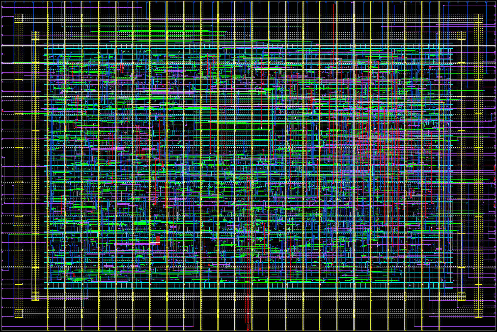

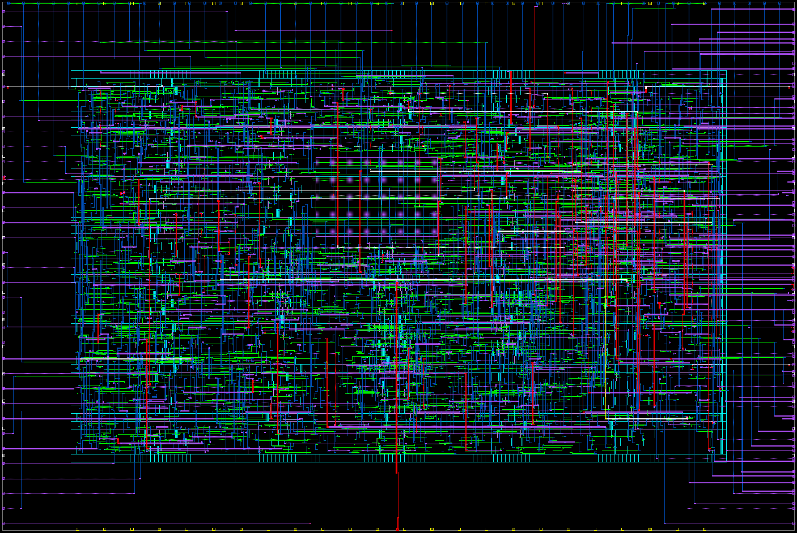

| Parameter | signoff |
| :- | -: |
| **Legality violations** | 0 |
| **Total overflow** | 58 |
| **Overflowing GRCs %** | \num{0.39} |
| **Utilization ratio** | \num{0.6713} |
| **Chip area** | \num{2254.280} |
| **Core area** | \num{1385.2800} |
| **- Excluded area** | \num[retain-negative-zero]{0.0000} |
| **- Total cell area** | \num{930.0024} |
| **\|  - Combinational area** | \num{498.57} |
| **\|  - Noncombinational area** | \num{431.43} |
| **Power (\unit{\pico\watt})** | \num{6.88E+7} |
| **- Dynamic power (\unit{\pico\watt})** | \num{6.85E+7} |
| **\|  - Cell internal power (\unit{\pico\watt})** | \num{3.95E+7} |
| **\|  - Net switching power (\unit{\pico\watt})** | \num{2.90E+7} |
| **- Leakage power (\unit{\pico\watt})** | \num{3.21E+5} |
| **Critical path length (\unit{\ns})** | \num{1.73} |
| **Worst setup slack (\unit{\ns})** | \num{-0.02} |
| **Worst hold slack (\unit{\ns})** | \num[retain-negative-zero]{-0.00} |
| **Net length** | \num{11802.76} |
| **Number of nets** | 1676 |
| **Number of cells** | 1252 |
| **- Number of buffers** | 37 |
| **- Number of inverters** | 23 |

Table: Final circuit parameters. Generated in the same way as Tables \ref{table-placement}, \ref{table-cts} and \label{table-routing}.\label{table-signoff}

Interesting details observed in logs and reports:

- The first `signoff_check_drc` listed 80 errors in total from 9 rules.
- The second one listed 32 errors from 7 rules.
- `signoff_create_metal_fill` increased density of layers M2-M5 from 5.9%-9.6% to 34.5%-44.9% and of layer M6 from 18% to 62%.
- `write_gds` command emitted a lot of warnings about unplaced cells beeing written to the GSDII file. The ones that were checked manually exist on layout and have attributes `is_placed true` and `physical_status placed`.
