---
# pandoc report.md --lua-filter ../pandoc-include-code-files/include-code-files.lua report.pdf

# Metadata
title: Advanced ASIC Design
subtitle: "Exercise no 6: SPYGLASS CDC & RDC"
author: Krzysztof Dziembała
date: "2025-06-24"

# Pandoc document settings
lang: en-GB
# Pandoc LaTeX variables
geometry: [a4paper, bindingoffset=0mm, inner=30mm, outer=30mm, top=30mm, bottom=30mm]
documentclass: report
fontsize: 12pt
colorlinks: true
numbersections: true
toc: true
lof: true # List of figures

header-includes:
  # # TikZ-timing package for timing diagrams
  # - |
  #   ````{=latex}
  #   \usepackage{tikz-timing}
  #   ````
  # # TikZ-timing: set background for D (data) to the same as on the lecture slides #FFFFCC
  # - |
  #   ````{=latex}
  #   \tikzset{timing/d/background/.style={fill={rgb,255:red,255; green,255; blue,204}}}
  #   ````
  # Remove "Chapter N" from the line above chapter name in report class document
  # I could not include a file for some reason, but this works
  - |
    ````{=latex}
    \usepackage{titlesec}
    \titleformat{\chapter}
      {\normalfont\LARGE\bfseries}{\thechapter.}{1em}{}
    \titlespacing*{\chapter}{0pt}{3.5ex plus 1ex minus .2ex}{2.3ex plus .2ex}
    ````
  # Keep footnote numbering
  - |
    ````{=latex}
    \counterwithout{footnote}{chapter}
    ````
  # Packages required for Logisim tables
  # - |
  #   ````{=latex}
  #   \usepackage{colortbl}
  #   \usepackage[dvipsnames]{xcolor}
  #   \usepackage{tikz-timing}
  #   \usepackage{tikz}
  #   \usetikzlibrary{karnaugh}
  #   ````
  # Wrap long source code lines and set smaller code font size
  - |
    ````{=latex}
    \usepackage{fvextra}
    \DefineVerbatimEnvironment{Highlighting}{Verbatim}{breaklines,breaknonspaceingroup,breakafter={/-_},fontsize=\footnotesize,commandchars=\\\{\}}
    ````
  # Allow hyphenation in `monospaced` text
  # - |
  #   ````{=latex}
  #   \usepackage[htt]{hyphenat}
  #   ````
  # Don't start chapter on new page (remove clearpage)
  # - |
  #   ````{=latex}
  #   \usepackage{etoolbox}
  #   \makeatletter
  #   \patchcmd{\chapter}{\if@openright\cleardoublepage\else\clearpage\fi}{}{}{}
  #   \makeatother
  #   ````
  # SI units
  - |
    ````{=latex}
    \usepackage{siunitx}
    ````
  # Landscape/horizontal pages, if pandoc does not see \begin and \end, it will still process everything inside as markdown
  # - |
  #   ````{=latex}
  #   \usepackage{pdflscape}
  #   \newcommand{\blandscape}{\begin{landscape}}
  #   \newcommand{\elandscape}{\end{landscape}}
  #   ````
---

<!-- There will be a warning until a new version of microtype gets released: https://github.com/schlcht/microtype/issues/53 -->

<!-- markdownlint-disable MD025 -->
# Unsynchronised CDC transfer

The simulation (Fig. \ref{fig-sim-unsync}) shows correct data transfer from clock domain A (\qty{50}{\MHz}) to B (\qty{80}{\MHz}). All the data from domain A is received in domain B with no errors.

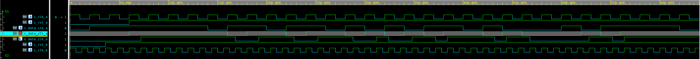

# SpyGlass analysis of CDC crossing

The SpyGlass tool reports an unsynchronised crossing (Fig. \ref{fig-spyglass-unsync}) from `r_data_clk_a` clocked by `i_clk_a` to `r_data_clk_b` clocked by `i_clk_b`. Because these two flip-flops are clocked by different clocks, metastability can occur on `r_data_clk_b` if a change from `r_data_clk_a` violates `r_data_clk_b` setup or hold times.
This does not occur in simulation, because RTL simulators don't simulate delays and signal fall/rise or setup/hold times. Metastability could be simulated in a SPICE simulator using a transistor model.

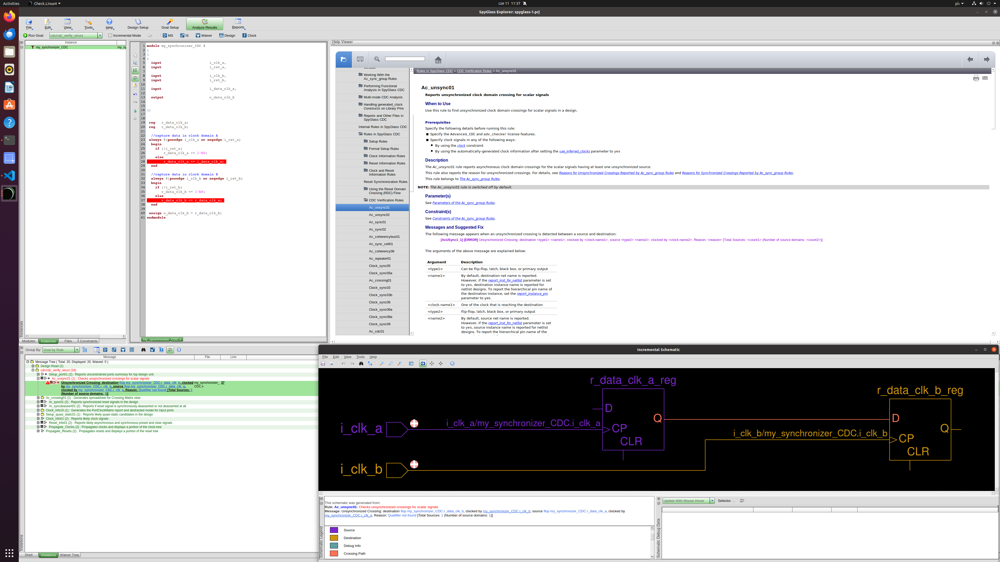

Metastability in scalar CDC crossings can be prevented by chaining multiple flip-flops in the receiving domain. Each subsequent register reduces the chance of metastability at the output, but in many cases just 2 are enough.

Adding `r_data_clk_b_sync` register clocked by `i_clk_b`, before `r_data_clk_b`, makes the output synchronised (Fig. \ref{fig-spyglass-CDC-sync}) and much more resistant to metastability:

```verilog {.numberLines}
module my_synchroniser_CDC #
(
)
(
  input                       i_clk_a,
  input                       i_rst_a,

  input                       i_clk_b,
  input                       i_rst_b,

  input                       i_data_clk_a,

  output                      o_data_clk_b


);


 reg   r_data_clk_a;
 reg   r_data_clk_b_sync;
 reg   r_data_clk_b;

  //capture data in clock domain A
 always @(posedge i_clk_a or negedge i_rst_a)
  begin
    if (!i_rst_a)
        r_data_clk_a <= 1'b0;
    else
        r_data_clk_a <= i_data_clk_a;
  end

  //capture data in clock domain B
  always @(posedge i_clk_b or negedge i_rst_b)
  begin
    if (!i_rst_b) begin
       r_data_clk_b_sync <= 1'b0;
       r_data_clk_b <= 1'b0;
    end else begin
       r_data_clk_b_sync <= r_data_clk_a;
       r_data_clk_b <= r_data_clk_b_sync;
    end
  end

 assign o_data_clk_b = r_data_clk_b;
endmodule
```

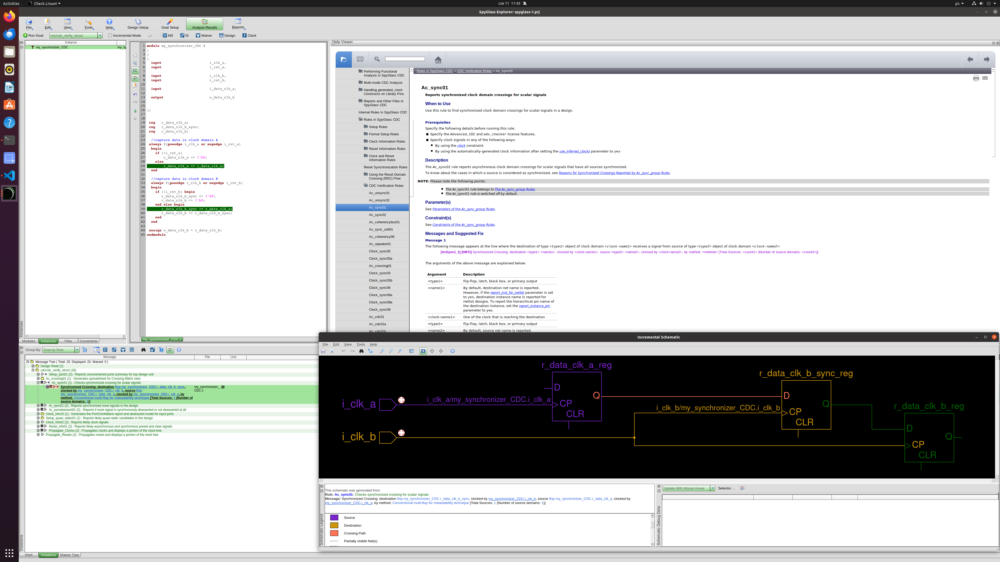

The only thing that changes in simulation (Fig. \ref{fig-sim-sync}) is that the output is now delayed by 1 additional cycle of the receiving clock.


# Data loss in fast-to-slow crossing

When crossing from faster to a slower clock domain there is a risk of data loss. The simulation (Fig. \ref{fig-sim-fast-slow-data-loss}) shows multiple single clock cycle impulses disappearing in the receiver clock domain. It happens because data in the faster domain can change multiple times, during a single clock cycle of the slower clock.

SpyGlass can detect this and produces an error as shown on Fig. \ref{fig-spyglass-fast-slow-data-loss}.

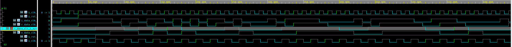

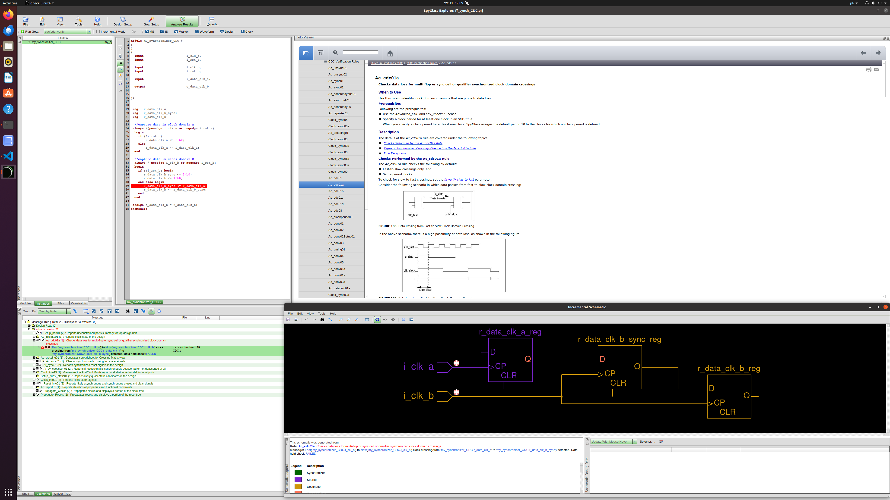

# Preventing data loss in fast-to-slow crossing

To prevent data loss, the source in faster domain must be instructed to hold data long enough for the slower domain to observe it. A simple way to do that, if clock frequencies are known, is outputting an enable signal to the sender domain, once enough clock cycles have passed in the faster domain for 1 clock cycle to occur in the slower domain ($\left \lceil \frac{FCLK_{fast}}{FCLK_{slow}} \right \rceil$).

The synchroniser module with `next_data_clk_a` enable signal is shown below. This signal is also used as enable on the `r_data_clk_a` register, because SpyGlass does not see the testbench and cannot check if the enable works correctly.

```{.verilog .numberLines include="CDC_RDC/ff_synch_CDC/my_synchronizer_CDC.v"}
```

The simulation (Fig. \ref{fig-sim-stretched}) shows that the enable signal effectively halves the data rate on the sender side and no data transition is lost.

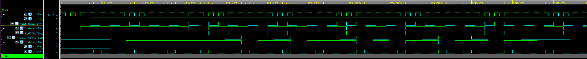

Used SGDC file:

```{.tcl .numberLines include="CDC_RDC/ff_synch_CDC/my_synch_CDC.sgdc"}
```

In this configuration (with `next_data_clk_a` being also used as enable for `r_data_clk_a`), SpyGlass reports no rule violations (Fig. \ref{fig-spyglass-stretched-all}) and confirms that there is no data loss (Fig. \ref{fig-spyglass-stretched}).

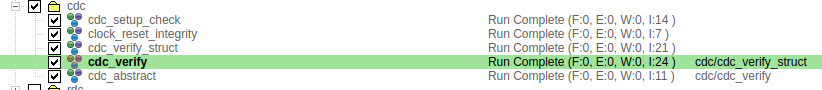


While this design works, it is generally recommended to stretch signals to 1.5 clock cycle (3 edges) of the slower clock ($\left \lceil \frac{3}{2} \times \frac{FCLK_{fast}}{FCLK_{slow}} \right \rceil$), because if only 2 edges are covered, then in case of metastability the pulse after synchronisation may disappear.

A different solution to this problem could be a free-running req-ack handshaking mechanism, but it has a higher latency.

# Reset domain crossing --- single clock, multiple asynchronous reset signals

When asynchronous reset is used, flip-flop reset synchronisation is necessary, because reset on `i_rst_a` may violate setup/hold times of on `r_data_b` (which does not use `i_rst_a`) and cause metastability. SpyGlass has lint rules that can detect unsynchronised RDC (Fig. \ref{fig-rdc-spyglass-violation}).

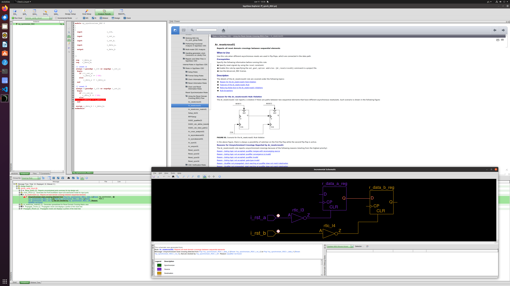

A conventional multi-FF synchronisation like before for CDC can be used to fix (see Fig. \ref{fig-rds-spyglass-pass}) the problem and violations reported by SpyGlass:

```{.verilog .numberLines include="CDC_RDC/ff_synch_RDC/my_synchronizer_RDC.v"}
```

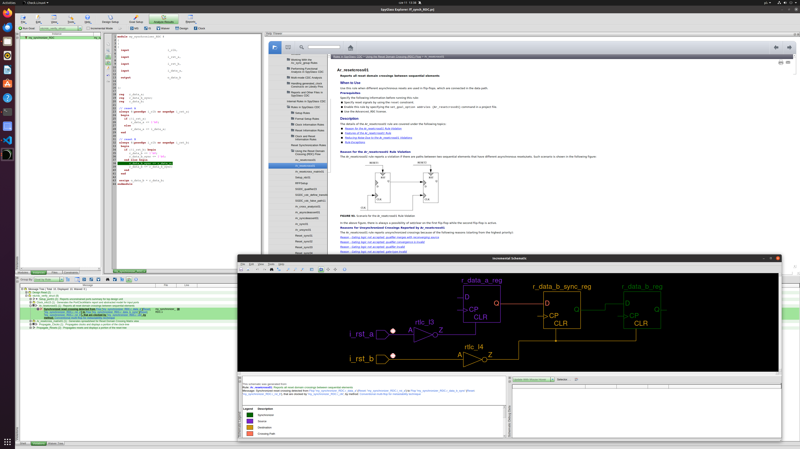

# Multiple clocks, single asynchronous reset

SpyGlass goals `cdc/cdc_verify_struct` and `cdc/cdc_verify` report 3 errors and 1 warning (Fig. \ref{fig-rdc2-violations}):

1. unsynchronised crossing from `r_data_clk_a` to `r_data_clk_b` (clock domain `i_clk_a` to `i_clk_b`),
2. `i_rst` input sampled by multiple clock domains,
3. `i_rst` resets `r_data_clk_a` (domain `i_clk_a`), but is generated in domain `i_clk_b`,
4. `i_rst` resets `r_data_clk_b` (domain `i_clk_b`), but is generated in domain `i_clk_a`.

The first problem can be fixed by using multiple flip-flops for synchronisation, like shown in [previous points](#spyglass-analysis-of-cdc-crossing). Remaining violations are fixed by synchronising `i_rst` deassertion separately in both clock domains. Reset deassertion must be synchronised, or there will be a risk of metastability due to recovery time violation. Applying the aforementioned changes (see schematic on Fig. \ref{fig-rdc2-schematic}) fixes all violations reported by SpyGlass, as shown on Fig. \ref{fig-rdc2-pass}.

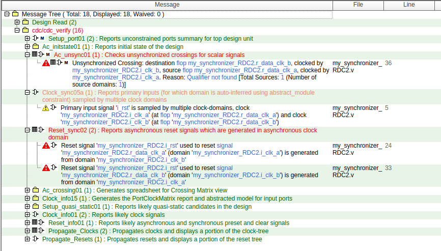

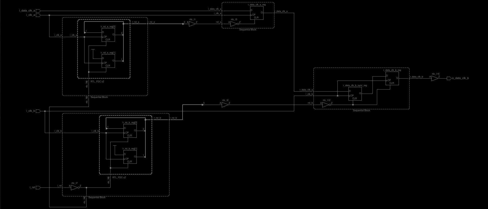

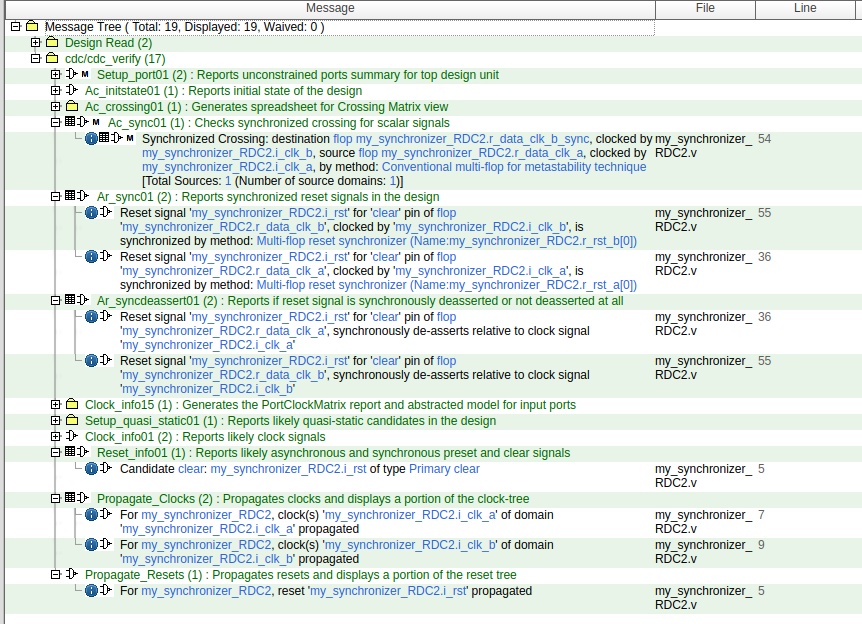

# Request-acknowledge synchroniser

The synchroniser uses a valid/ready interface in both receiving and sending ends, which enables backpressure - data is sent/consumed only when it can, as opposed to the level synchronizer in `ff_synch_CDC` which would transfer the data continuously. The inner data transfer mechanism is as follows:

1. sender asserts the request signal (after data has been captured from the sender side)
2. when request arrives in the receiver domain (and it is ready to receive new data), the receiver captures the data and asserts the acknowledge signal
3. when the acknowledge arrives in sender domain, the sender deasserts request
4. when receiver observes request going low it deasserts acknowledge
5. sender waits for acknowledge to go low before it can capture more data and repeat the process

SpyGlass reports (Fig. \ref{fig-req-ack-violations}) a number of violations in this module. No signal that crosses clock domains is synchronised and the global reset deassertion isn't synchronised with any clock either.


Fixing these errors requires synchronising resets (appropriately: sender -- `i_clk_a`, receiver -- `i_clk_b`), as well as the request (to `i_clk_b` before it goes to receiver) and acknowledge (to `i_clk_a` before it enters the sender) signals. The data bus `data_clk_a` does not have to be synchronised, because it is stable while `req` is high and, once `req` goes high, it stays high until `ack`, at which point the data has already been received.
After fixing those issues, SpyGlass reports no more errors (Fig. \ref{fig-req-ack-pass}). Correct operation of the synchroniser can be observed on the waveform on Fig. \ref{fig-req-ack-sim} and in the log fragment below:

```{.text .numberLines include="CDC_RDC/req_ack/sim_log.txt" startLine=713 endLine=730}
```


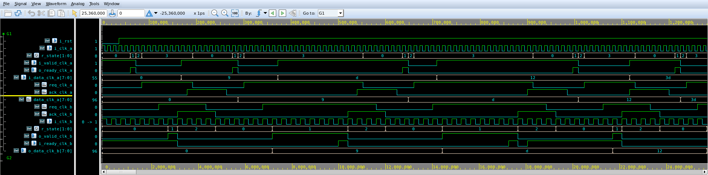

# FIFO synchroniser

FIFO synchroniser is based on a dual port memory with sender managing the write port and receiver handling read port. The `full` and `empty` signals are calculated in the domains where they are used --- writer and reader respectively. Both these calculations use read and write pointers. Pointer from the same domain is used "as is", but the other one must be synchronised.
With the synchronisation in place, the "other" pointer comes delayed, so the writer can sometimes think that the FIFO is full when it is not and the reader can believe the same thing about fifo being empty. This is, fortunately, not a problem that could cause data corruption/loss, but may introduce slight delays.

SpyGlass reports lots of violations in this design (Fig. \ref{fig-fifo-violations}), because reset has to be synchronised in each domain and read/write pointers must be synchronised when crossing domains.

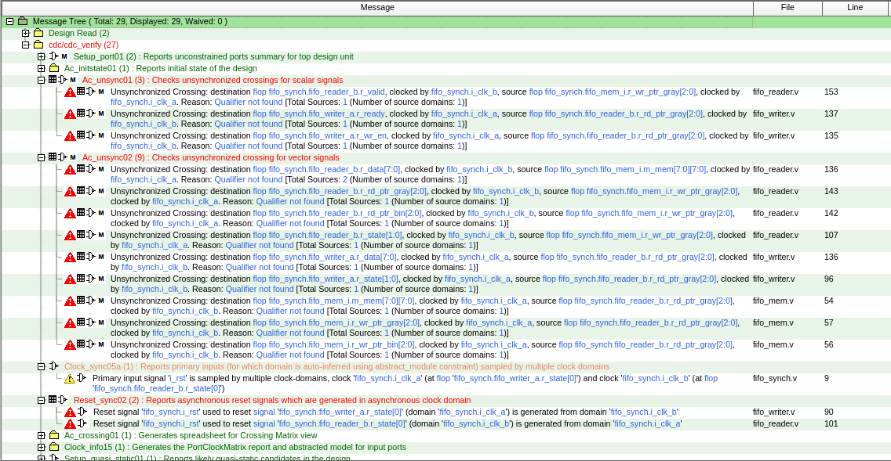

With those problems fixed, SpyGlass still emits 4 warnings in `cdc/cdc_verify_struct` (Fig. \ref{fig-fifo-warnings-struct}). The 2 warnings about signal convergence in `cdc/cdc_verify` (Fig. \ref{fig-fifo-warnings-ok}) are replaced with information that they correctly use Gray encoding and this is not a problem. The Gray encoding verification (using formal engine) is disabled in the `cdc/cdc_verify_struct` goal, so SpyGlass emits a warning, because it cannot verify correctness.

FIFO pointers must use Gray encoding, because when a multi-bit signal converges after synchronisation in a different clock domain, separate bits may stabilise to either old or new value. A typical binary pointer going e.g. from `0111` to `1000` toggles all bits and after synchronisation can be any value. Multiple filip-flop synchronisation prevents metastability on output, but the synchroniser's first FF can be metastable and the synchroniser can output (stable) 0 or 1 randomly if a change of synchronised signal has occurred. Gray encoding guarantees that, when incrementing, only 1 bit changes, so after synchronisation it will have either old or new value, not something completely random. This also means that the pointers must increment by 1 and wrap around, or otherwise more bits will change and the problem will return.

Warnings about synchronising reset multiple times are emitted by SpyGlass, because it counts already synchronised resets used to reset flip-flops in pointer synchronisers as reset synchronisation. Because pointers have more than 1 bit, SpyGlass sees multiple parallel "reset synchronisers".


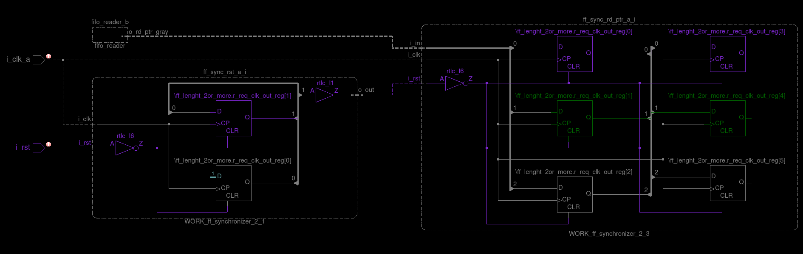

When FIFO is supposed to handle bursts of data, the depth calculations must take into account write and read rates, which depend on write/read clocks and how many clock cycles occur between writes/reads. The depth can be calculated using the following formula:

$$ N = B - \frac{B F_R}{F_W} \frac{D_W}{D_R} = B \left ( 1 - \frac{F_R}{F_W} \frac{D_W}{D_R} \right ) $$

where:

- $N$ --- FIFO depth
- $B$ --- burst size (in words)
- $F_W$ --- frequency of clock in write domain
- $F_R$ --- frequency of clock in read domain
- $D_W$ --- _delay_ between writes, write is issued every $D_W$ cycle (1 for continuous)
- $D_R$ --- _delay_ between reads, read is issued every $D_W$ cycle (1 for continuous)

Correct operation of the synchroniser can be observed on the waveform on Fig. \ref{fig-fifo-sim} and in the log fragments below:

```{.text .numberLines include="CDC_RDC/fifo/sim_log.txt" startLine=728 endLine=738}
```

```{.text .numberLines include="CDC_RDC/fifo/sim_log.txt" startLine=770 endLine=783}
```

Although the FIFO works, it quickly fills up and cannot keep up with the sender, forcing it to wait.

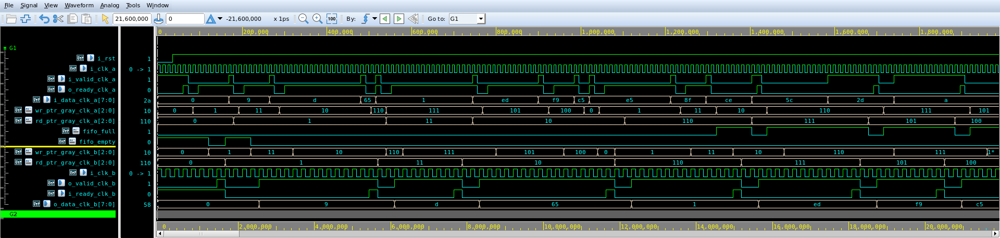

# Comparison of req-ack and FIFO synchronisers

To ensure proper comparison, the delay min/max values are the same, because randomness could make results invalid. Simulation resolution and data width were not changed. Data width does not affect the simulation results.

Reset deassertion is considered as transmission start time. Transmission end time is the time logged in last _"Data pkg: %d recived in domain B (Val in hex): %h, at Time: %t"_[^typo] message.

| Parameters | Req-Ack | FIFO |
| ----- | -: | -: |
| A=\qty{80}{\MHz}, B=\qty{50}{\MHz}, L=1, S=0, R=0 | 159964 | 159964 |
| A=\qty{80}{\MHz}, B=\qty{50}{\MHz}, L=10, S=0, R=0 | 2059964 | 699964 |
| A=\qty{80}{\MHz}, B=\qty{50}{\MHz}, L=100, S=0, R=0 | 20959964 | 6099964 |
| A=\qty{80}{\MHz}, B=\qty{50}{\MHz}, L=10, S=10, R=0 | 2059964 | 1339964 |
| A=\qty{80}{\MHz}, B=\qty{50}{\MHz}, L=100, S=10, R=0 | 20959964 | 13219964 |
| A=\qty{80}{\MHz}, B=\qty{50}{\MHz}, L=10, S=0, R=10 | 2139964 | 2139964 |
| A=\qty{50}{\MHz}, B=\qty{80}{\MHz}, L=10, S=0, R=0 | 2159940 | 719940 |
| A=\qty{50}{\MHz}, B=\qty{80}{\MHz}, L=100, S=0, R=0 | 21959940 | 6119940 |

Table: Transmission time comparison of req-ack and FIFO synchronisers in different scenarios.\label{table-synch-cmp}

Parameters used in Table \ref{table-synch-cmp} are:

- A --- sender clock frequency
- B --- receiver clock frequency
- L --- number of words to send
- S --- delay between valid signals in sender
- R --- delay between ready signals in receiver

For sending data in bursts, FIFO synchroniser is way faster than req-ack. However, when the data is sent infrequently req-ack has the same latency, so the transfer takes the same or similar amount of time. Req-ack synchroniser consumes less resources, because it does not need memory like FIFO and req/ack signals are single bits compared to multi-bit pointers.

It should be possible to make the req-ack synchroniser faster. Right now it has a separate `CAPTURE` state that could be eliminated.

[^typo]: The message really says _recived_. _Receiver_ and _received_ are mistyped almost everywhere in the code.

# Source code {-}

## `my_synchronizer_RDC2.v` {-}

```{.verilog .numberLines include="CDC_RDC/ff_synch_RDC2/my_synchronizer_RDC2.v"}
```

## `req_ack_synch.v` {-}

```{.verilog .numberLines include="CDC_RDC/req_ack/req_ack_synch.v"}
```

## `fifo_synch.v` {-}

```{.verilog .numberLines include="CDC_RDC/fifo/fifo_synch.v"}
```

## `sim_both.sh` {-}

This script was used for [synchroniser comparison](#comparison-of-req-ack-and-fifo-synchronisers).

```{.bash .numberLines include="CDC_RDC/sim_both.sh"}
```
